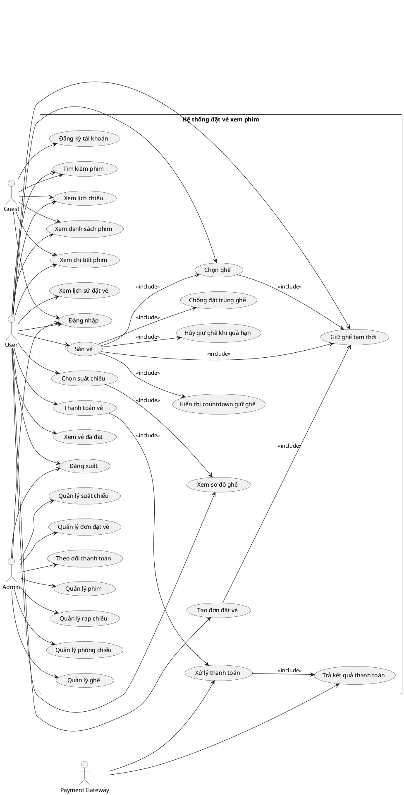

# [Phần 2] Xác định actor và use case

## Mục tiêu

Issue này nhằm xác định các tác nhân tham gia vào hệ thống đặt vé xem phim và các ca sử dụng chính tương ứng với từng tác nhân.

Việc xác định actor và use case giúp nhóm hiểu rõ ai sẽ sử dụng hệ thống, mỗi nhóm người dùng có thể thực hiện những chức năng nào, từ đó làm cơ sở để xây dựng sơ đồ Use Case, viết user stories, thiết kế database, thiết kế API và triển khai chức năng.

---

## 1. Mô tả tổng quan

Hệ thống đặt vé xem phim cho phép người dùng xem thông tin phim, chọn suất chiếu, chọn ghế, đặt vé và thanh toán.

Ngoài ra, hệ thống có chức năng săn vé, trong đó nhiều người dùng có thể cùng truy cập vào một suất chiếu và cạnh tranh chọn ghế trong thời gian mở bán.

Các actor chính của hệ thống gồm:

- Guest
- User
- Admin
- Payment Gateway

---

## 2. Danh sách actor

### 2.1. Guest

Guest là người dùng chưa đăng nhập vào hệ thống.

Guest có thể xem các thông tin công khai như danh sách phim, chi tiết phim và lịch chiếu. Tuy nhiên, Guest không thể đặt vé, chọn ghế hoặc thanh toán nếu chưa đăng nhập.

#### Use case của Guest

- Xem danh sách phim
- Xem chi tiết phim
- Xem lịch chiếu
- Tìm kiếm phim
- Đăng ký tài khoản
- Đăng nhập hệ thống

---

### 2.2. User

User là người dùng đã có tài khoản và đăng nhập vào hệ thống.

User có thể thực hiện các chức năng chính như xem phim, chọn suất chiếu, chọn ghế, giữ ghế tạm thời, đặt vé, thanh toán và xem lịch sử vé đã đặt.

#### Use case của User

- Đăng nhập
- Đăng xuất
- Xem danh sách phim
- Xem chi tiết phim
- Tìm kiếm phim
- Xem lịch chiếu
- Chọn suất chiếu
- Xem sơ đồ ghế
- Chọn ghế
- Giữ ghế tạm thời
- Tạo đơn đặt vé
- Thanh toán đơn vé
- Xem vé đã đặt
- Xem lịch sử đặt vé
- Hủy thao tác đặt vé khi chưa thanh toán
- Nhận thông báo khi ghế đã được người khác giữ
- Nhận thông báo khi hết thời gian giữ ghế

---

### 2.3. Admin

Admin là người quản trị hệ thống.

Admin có quyền quản lý dữ liệu trong hệ thống như phim, rạp, phòng chiếu, ghế, suất chiếu và đơn đặt vé. Admin không trực tiếp tham gia đặt vé như User mà tập trung vào quản lý và vận hành hệ thống.

#### Use case của Admin

- Đăng nhập trang quản trị
- Đăng xuất
- Quản lý phim
- Thêm phim
- Sửa thông tin phim
- Xóa phim
- Quản lý rạp chiếu
- Thêm rạp chiếu
- Sửa thông tin rạp chiếu
- Xóa rạp chiếu
- Quản lý phòng chiếu
- Thêm phòng chiếu
- Sửa thông tin phòng chiếu
- Xóa phòng chiếu
- Quản lý ghế
- Thiết lập sơ đồ ghế
- Khóa hoặc mở ghế
- Quản lý suất chiếu
- Thêm suất chiếu
- Sửa suất chiếu
- Xóa suất chiếu
- Kiểm tra trùng lịch chiếu
- Xem danh sách đơn đặt vé
- Xem chi tiết đơn đặt vé
- Theo dõi trạng thái ghế
- Theo dõi trạng thái thanh toán

---

### 2.4. Payment Gateway

Payment Gateway là hệ thống thanh toán bên ngoài hoặc cổng thanh toán giả lập được dùng trong đồ án.

Trong phạm vi đồ án, Payment Gateway có thể được mô phỏng để xử lý thanh toán thành công hoặc thất bại. Actor này không phải người dùng trực tiếp mà là hệ thống bên ngoài tương tác với hệ thống đặt vé.

#### Use case của Payment Gateway

- Nhận yêu cầu thanh toán
- Xử lý thanh toán
- Trả kết quả thanh toán thành công
- Trả kết quả thanh toán thất bại
- Gửi phản hồi trạng thái thanh toán về hệ thống

---

## 3. Danh sách use case chính của hệ thống

### 3.1. Nhóm use case tài khoản

| Use case | Actor | Mô tả |
|---|---|---|
| Đăng ký tài khoản | Guest | Người dùng tạo tài khoản mới |
| Đăng nhập | Guest, User, Admin | Người dùng hoặc admin đăng nhập hệ thống |
| Đăng xuất | User, Admin | Người dùng hoặc admin thoát khỏi hệ thống |
| Phân quyền truy cập | System | Hệ thống kiểm tra quyền User hoặc Admin |

---

### 3.2. Nhóm use case xem phim

| Use case | Actor | Mô tả |
|---|---|---|
| Xem danh sách phim | Guest, User | Hiển thị danh sách phim đang chiếu và sắp chiếu |
| Xem chi tiết phim | Guest, User | Hiển thị thông tin chi tiết của một bộ phim |
| Tìm kiếm phim | Guest, User | Tìm phim theo tên hoặc thể loại |
| Xem lịch chiếu | Guest, User | Xem các suất chiếu theo phim, rạp hoặc ngày |

---

### 3.3. Nhóm use case đặt vé

| Use case | Actor | Mô tả |
|---|---|---|
| Chọn suất chiếu | User | Người dùng chọn suất chiếu muốn xem |
| Xem sơ đồ ghế | User | Hệ thống hiển thị sơ đồ ghế của phòng chiếu |
| Chọn ghế | User | Người dùng chọn một hoặc nhiều ghế còn trống |
| Giữ ghế tạm thời | User | Hệ thống giữ ghế trong thời gian giới hạn |
| Tạo đơn đặt vé | User | Hệ thống tạo đơn đặt vé sau khi chọn ghế |
| Thanh toán đơn vé | User, Payment Gateway | Người dùng thanh toán đơn vé thông qua cổng thanh toán |
| Xem vé đã đặt | User | Người dùng xem thông tin vé sau khi thanh toán thành công |
| Xem lịch sử đặt vé | User | Người dùng xem danh sách các vé đã từng đặt |

---

### 3.4. Nhóm use case săn vé

| Use case | Actor | Mô tả |
|---|---|---|
| Truy cập suất chiếu đang mở bán | User | Người dùng vào suất chiếu có nhiều người cùng đặt |
| Chọn ghế khi săn vé | User | Người dùng chọn ghế trong thời gian mở bán |
| Giữ ghế khi săn vé | User | Hệ thống khóa ghế tạm thời cho người chọn thành công |
| Chống đặt trùng ghế | System | Hệ thống không cho nhiều người đặt cùng một ghế |
| Hiển thị countdown giữ ghế | System | Hệ thống hiển thị thời gian còn lại để thanh toán |
| Hủy giữ ghế khi quá hạn | System | Hệ thống mở lại ghế nếu người dùng không thanh toán đúng hạn |
| Cập nhật trạng thái ghế | System | Hệ thống cập nhật ghế AVAILABLE, HELD, SOLD hoặc BLOCKED |

---

### 3.5. Nhóm use case quản trị

| Use case | Actor | Mô tả |
|---|---|---|
| Quản lý phim | Admin | Admin xem danh sách, thêm, sửa, xóa phim |
| Quản lý rạp | Admin | Admin quản lý thông tin rạp chiếu |
| Quản lý phòng chiếu | Admin | Admin quản lý phòng chiếu trong từng rạp |
| Quản lý ghế | Admin | Admin thiết lập và cập nhật trạng thái ghế |
| Quản lý suất chiếu | Admin | Admin thêm, sửa, xóa suất chiếu |
| Kiểm tra trùng lịch chiếu | Admin, System | Hệ thống hỗ trợ kiểm tra suất chiếu bị trùng |
| Quản lý đơn đặt vé | Admin | Admin xem danh sách và chi tiết đơn đặt vé |
| Theo dõi thanh toán | Admin | Admin xem trạng thái thanh toán của đơn vé |

---

## 4. Use case chi tiết: Đặt vé xem phim

### Tên use case

Đặt vé xem phim

### Actor chính

User

### Actor phụ

Payment Gateway

### Mục tiêu

Cho phép người dùng chọn phim, chọn suất chiếu, chọn ghế, tạo đơn đặt vé và thanh toán để nhận vé xem phim.

### Tiền điều kiện

- Người dùng đã đăng nhập.
- Phim và suất chiếu đã tồn tại trong hệ thống.
- Suất chiếu còn ghế trống.
- Ghế được chọn chưa bị bán hoặc giữ bởi người khác.

### Luồng chính

1. User xem danh sách phim.
2. User chọn một phim.
3. Hệ thống hiển thị chi tiết phim và lịch chiếu.
4. User chọn ngày chiếu, rạp và suất chiếu.
5. Hệ thống hiển thị sơ đồ ghế.
6. User chọn ghế còn trống.
7. Hệ thống kiểm tra trạng thái ghế.
8. Hệ thống giữ ghế tạm thời cho User.
9. Hệ thống tạo đơn đặt vé.
10. User chuyển sang bước thanh toán.
11. Payment Gateway xử lý thanh toán.
12. Payment Gateway trả kết quả thanh toán thành công.
13. Hệ thống cập nhật trạng thái đơn vé thành đã thanh toán.
14. Hệ thống cập nhật trạng thái ghế thành đã bán.
15. Hệ thống tạo vé cho User.
16. User xem thông tin vé đã đặt.

### Luồng thay thế

#### Ghế đã bị người khác giữ

1. User chọn ghế.
2. Hệ thống kiểm tra và phát hiện ghế đang ở trạng thái HELD.
3. Hệ thống thông báo ghế đã được người khác giữ.
4. User chọn ghế khác.

#### Ghế đã được bán

1. User chọn ghế.
2. Hệ thống kiểm tra và phát hiện ghế đang ở trạng thái SOLD.
3. Hệ thống thông báo ghế đã được bán.
4. User chọn ghế khác.

#### Thanh toán thất bại

1. User thực hiện thanh toán.
2. Payment Gateway trả kết quả thanh toán thất bại.
3. Hệ thống cập nhật đơn vé ở trạng thái thanh toán thất bại.
4. User có thể thử thanh toán lại nếu đơn chưa hết hạn.

#### Hết thời gian giữ ghế

1. User chọn ghế và tạo đơn đặt vé.
2. User không thanh toán trong thời gian quy định.
3. Hệ thống chuyển đơn vé sang trạng thái hết hạn.
4. Hệ thống mở lại ghế để người khác có thể đặt.

### Hậu điều kiện

- Nếu thanh toán thành công, vé được tạo và ghế chuyển sang SOLD.
- Nếu thanh toán thất bại hoặc hết hạn, đơn vé không được xác nhận.
- Nếu quá thời gian giữ ghế, ghế được chuyển lại về AVAILABLE.

---

## 5. Use case chi tiết: Thanh toán vé

### Tên use case

Thanh toán vé

### Actor chính

User

### Actor phụ

Payment Gateway

### Mục tiêu

Cho phép người dùng thanh toán đơn đặt vé đã được tạo.

### Tiền điều kiện

- User đã đăng nhập.
- User đã chọn ghế.
- Đơn đặt vé đã được tạo.
- Đơn đặt vé chưa hết hạn.
- Ghế trong đơn đang ở trạng thái HELD.

### Luồng chính

1. User xem thông tin đơn đặt vé.
2. User chọn phương thức thanh toán.
3. Hệ thống gửi yêu cầu thanh toán đến Payment Gateway.
4. Payment Gateway xử lý thanh toán.
5. Payment Gateway trả kết quả thanh toán thành công.
6. Hệ thống cập nhật trạng thái thanh toán.
7. Hệ thống cập nhật trạng thái đơn vé thành PAID.
8. Hệ thống cập nhật trạng thái ghế thành SOLD.
9. Hệ thống tạo vé.
10. User nhận thông tin vé.

### Luồng thay thế

#### Thanh toán thất bại

1. Payment Gateway trả kết quả thất bại.
2. Hệ thống cập nhật trạng thái thanh toán thất bại.
3. User được thông báo thanh toán không thành công.
4. User có thể thử thanh toán lại nếu đơn chưa hết hạn.

#### Đơn vé đã hết hạn

1. User thực hiện thanh toán sau thời gian cho phép.
2. Hệ thống kiểm tra và phát hiện đơn đã hết hạn.
3. Hệ thống từ chối thanh toán.
4. Hệ thống mở lại ghế nếu ghế chưa được bán.

### Hậu điều kiện

- Nếu thanh toán thành công, đơn vé được xác nhận và vé được tạo.
- Nếu thanh toán thất bại, vé chưa được tạo.
- Nếu đơn hết hạn, ghế được mở lại cho người dùng khác.

---

## 6. Use case diagram

Có thể sử dụng PlantUML sau để vẽ sơ đồ Use Case:

---
