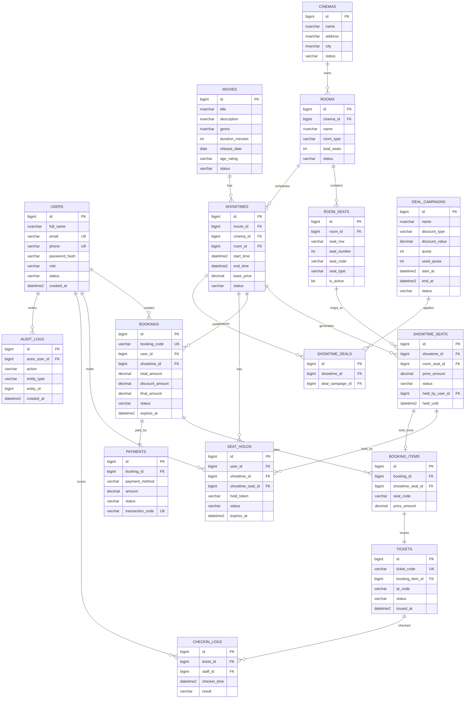

# [Database] Thiết kế cơ sở dữ liệu hệ thống đặt vé xem phim

## 1. Mục tiêu

Thiết kế cơ sở dữ liệu cho hệ thống **CineHunt MVP – hệ thống đặt vé xem phim săn giá hời**, đảm bảo dữ liệu được tổ chức rõ ràng, có ràng buộc toàn vẹn, hỗ trợ đầy đủ các luồng nghiệp vụ chính và làm nền tảng triển khai backend.

Cơ sở dữ liệu cần phục vụ các nghiệp vụ:

- Quản lý tài khoản người dùng và phân quyền.
- Quản lý phim, rạp, phòng chiếu và ghế.
- Quản lý lịch chiếu theo phim, rạp, phòng và thời gian.
- Quản lý trạng thái ghế theo từng suất chiếu.
- Giữ ghế tạm thời trong thời gian giới hạn.
- Tạo đơn đặt vé và chi tiết ghế đã đặt.
- Thanh toán giả lập và cập nhật trạng thái thanh toán.
- Phát hành vé điện tử QR sau khi thanh toán thành công.
- Ghi nhận lịch sử check-in và thao tác quản trị.
- Hỗ trợ mở rộng chức năng deal/khuyến mãi trong tương lai.

---

## 2. Phạm vi thiết kế database

Database tập trung cho bản MVP của hệ thống đặt vé xem phim, gồm các nhóm dữ liệu chính:

| Nhóm dữ liệu | Mục đích |
|---|---|
| User & Role | Quản lý tài khoản, phân quyền Customer, Staff, Admin |
| Movie | Quản lý thông tin phim |
| Cinema & Room | Quản lý rạp, phòng chiếu, sơ đồ ghế gốc |
| Showtime | Quản lý lịch chiếu |
| Seat Inventory | Quản lý trạng thái từng ghế theo từng suất chiếu |
| Seat Hold | Quản lý giữ ghế tạm thời, chống đặt trùng ghế |
| Booking | Quản lý đơn đặt vé và chi tiết ghế |
| Payment | Quản lý thanh toán giả lập |
| Ticket | Quản lý vé điện tử QR |
| Check-in | Ghi nhận nhân viên soát vé quét QR |
| Deal/Promotion | Quản lý khuyến mãi/săn giá hời |
| Audit Log | Ghi nhận thao tác quản trị quan trọng |

---

## 3. Danh sách bảng đề xuất

### 3.1. `users`

Lưu thông tin tài khoản đăng nhập của khách hàng, nhân viên và quản trị viên.

| Cột | Kiểu dữ liệu | Ràng buộc | Mô tả |
|---|---|---|---|
| id | BIGINT | PK, IDENTITY | Mã người dùng |
| full_name | NVARCHAR(100) | NOT NULL | Họ tên |
| email | VARCHAR(255) | UNIQUE, NOT NULL | Email đăng nhập |
| phone | VARCHAR(20) | UNIQUE, NULL | Số điện thoại |
| password_hash | VARCHAR(255) | NOT NULL | Mật khẩu đã mã hóa |
| role | VARCHAR(20) | CHECK | CUSTOMER, STAFF, ADMIN |
| status | VARCHAR(20) | CHECK | ACTIVE, LOCKED, DELETED |
| created_at | DATETIME2 | DEFAULT GETDATE() | Ngày tạo |
| updated_at | DATETIME2 | NULL | Ngày cập nhật |

---

### 3.2. `movies`

Lưu thông tin phim.

| Cột | Kiểu dữ liệu | Ràng buộc | Mô tả |
|---|---|---|---|
| id | BIGINT | PK, IDENTITY | Mã phim |
| title | NVARCHAR(255) | NOT NULL | Tên phim |
| description | NVARCHAR(MAX) | NULL | Mô tả phim |
| genre | NVARCHAR(100) | NULL | Thể loại |
| duration_minutes | INT | CHECK > 0 | Thời lượng phim |
| release_date | DATE | NULL | Ngày khởi chiếu |
| age_rating | VARCHAR(20) | NULL | Phân loại độ tuổi |
| poster_url | VARCHAR(500) | NULL | Ảnh poster |
| trailer_url | VARCHAR(500) | NULL | Link trailer |
| status | VARCHAR(30) | CHECK | COMING_SOON, NOW_SHOWING, ENDED, HIDDEN |
| created_at | DATETIME2 | DEFAULT GETDATE() | Ngày tạo |
| updated_at | DATETIME2 | NULL | Ngày cập nhật |

---

### 3.3. `cinemas`

Lưu thông tin cụm rạp.

| Cột | Kiểu dữ liệu | Ràng buộc | Mô tả |
|---|---|---|---|
| id | BIGINT | PK, IDENTITY | Mã rạp |
| name | NVARCHAR(255) | NOT NULL | Tên rạp |
| address | NVARCHAR(500) | NOT NULL | Địa chỉ |
| city | NVARCHAR(100) | NULL | Thành phố |
| phone | VARCHAR(20) | NULL | Số điện thoại |
| status | VARCHAR(20) | CHECK | ACTIVE, INACTIVE |
| created_at | DATETIME2 | DEFAULT GETDATE() | Ngày tạo |

---

### 3.4. `rooms`

Lưu thông tin phòng chiếu thuộc rạp.

| Cột | Kiểu dữ liệu | Ràng buộc | Mô tả |
|---|---|---|---|
| id | BIGINT | PK, IDENTITY | Mã phòng |
| cinema_id | BIGINT | FK | Thuộc rạp nào |
| name | NVARCHAR(100) | NOT NULL | Tên phòng |
| room_type | VARCHAR(30) | NULL | STANDARD, VIP, IMAX |
| total_seats | INT | CHECK >= 0 | Tổng số ghế |
| status | VARCHAR(20) | CHECK | ACTIVE, MAINTENANCE, INACTIVE |
| created_at | DATETIME2 | DEFAULT GETDATE() | Ngày tạo |

---

### 3.5. `room_seats`

Lưu sơ đồ ghế gốc của từng phòng chiếu.

| Cột | Kiểu dữ liệu | Ràng buộc | Mô tả |
|---|---|---|---|
| id | BIGINT | PK, IDENTITY | Mã ghế |
| room_id | BIGINT | FK | Phòng chiếu |
| seat_row | VARCHAR(10) | NOT NULL | Hàng ghế |
| seat_number | INT | NOT NULL | Số ghế |
| seat_code | VARCHAR(20) | NOT NULL | Mã ghế, ví dụ A1 |
| seat_type | VARCHAR(30) | CHECK | NORMAL, VIP, COUPLE |
| is_active | BIT | DEFAULT 1 | Ghế còn sử dụng không |

Ràng buộc quan trọng:

```sql
UNIQUE (room_id, seat_code)
```

---

### 3.6. `showtimes`

Lưu lịch chiếu phim.

| Cột | Kiểu dữ liệu | Ràng buộc | Mô tả |
|---|---|---|---|
| id | BIGINT | PK, IDENTITY | Mã suất chiếu |
| movie_id | BIGINT | FK | Phim được chiếu |
| cinema_id | BIGINT | FK | Rạp chiếu |
| room_id | BIGINT | FK | Phòng chiếu |
| start_time | DATETIME2 | NOT NULL | Giờ bắt đầu |
| end_time | DATETIME2 | NOT NULL | Giờ kết thúc |
| base_price | DECIMAL(12,2) | CHECK >= 0 | Giá vé cơ bản |
| status | VARCHAR(30) | CHECK | DRAFT, OPEN_FOR_SALE, CLOSED, CANCELLED |
| created_at | DATETIME2 | DEFAULT GETDATE() | Ngày tạo |

Ràng buộc quan trọng:

```sql
CHECK (end_time > start_time)
```

Lưu ý nghiệp vụ: không cho phép tạo hai suất chiếu bị trùng thời gian trong cùng một phòng.

---

### 3.7. `showtime_seats`

Lưu trạng thái từng ghế theo từng suất chiếu. Đây là bảng quan trọng nhất để chống đặt trùng ghế.

| Cột | Kiểu dữ liệu | Ràng buộc | Mô tả |
|---|---|---|---|
| id | BIGINT | PK, IDENTITY | Mã ghế theo suất chiếu |
| showtime_id | BIGINT | FK | Suất chiếu |
| room_seat_id | BIGINT | FK | Ghế gốc |
| price_amount | DECIMAL(12,2) | CHECK >= 0 | Giá ghế thực tế |
| status | VARCHAR(20) | CHECK | AVAILABLE, HELD, SOLD, BLOCKED |
| held_by_user_id | BIGINT | FK, NULL | Người đang giữ ghế |
| held_until | DATETIME2 | NULL | Thời điểm hết hạn giữ ghế |
| booking_item_id | BIGINT | FK, NULL | Ghế đã thuộc booking item nào |
| updated_at | DATETIME2 | NULL | Ngày cập nhật |

Ràng buộc quan trọng:

```sql
UNIQUE (showtime_id, room_seat_id)
```

---

### 3.8. `seat_holds`

Lưu lịch sử giữ ghế tạm thời.

| Cột | Kiểu dữ liệu | Ràng buộc | Mô tả |
|---|---|---|---|
| id | BIGINT | PK, IDENTITY | Mã lượt giữ ghế |
| user_id | BIGINT | FK | Người giữ ghế |
| showtime_id | BIGINT | FK | Suất chiếu |
| showtime_seat_id | BIGINT | FK | Ghế được giữ |
| hold_token | VARCHAR(100) | NOT NULL | Mã giữ ghế |
| status | VARCHAR(20) | CHECK | ACTIVE, CONFIRMED, EXPIRED, RELEASED |
| expires_at | DATETIME2 | NOT NULL | Thời điểm hết hạn |
| created_at | DATETIME2 | DEFAULT GETDATE() | Thời điểm giữ ghế |

Quy tắc nghiệp vụ:

- Thời gian giữ ghế mặc định: 5 phút.
- Mỗi ghế tại một suất chiếu chỉ có một hold ACTIVE hợp lệ.
- Khi hold hết hạn, ghế chuyển về AVAILABLE.
- Khi thanh toán thành công, hold chuyển thành CONFIRMED.

---

### 3.9. `bookings`

Lưu thông tin đơn đặt vé.

| Cột | Kiểu dữ liệu | Ràng buộc | Mô tả |
|---|---|---|---|
| id | BIGINT | PK, IDENTITY | Mã đơn |
| booking_code | VARCHAR(50) | UNIQUE, NOT NULL | Mã đặt vé |
| user_id | BIGINT | FK | Người đặt |
| showtime_id | BIGINT | FK | Suất chiếu |
| total_amount | DECIMAL(12,2) | CHECK >= 0 | Tổng tiền |
| discount_amount | DECIMAL(12,2) | DEFAULT 0 | Tiền giảm giá |
| final_amount | DECIMAL(12,2) | CHECK >= 0 | Số tiền cuối cùng |
| status | VARCHAR(30) | CHECK | PENDING_PAYMENT, PAID, CANCELLED, EXPIRED, REFUNDED |
| expires_at | DATETIME2 | NULL | Hạn thanh toán |
| created_at | DATETIME2 | DEFAULT GETDATE() | Ngày tạo |
| paid_at | DATETIME2 | NULL | Ngày thanh toán |

---

### 3.10. `booking_items`

Lưu chi tiết từng ghế trong đơn đặt vé.

| Cột | Kiểu dữ liệu | Ràng buộc | Mô tả |
|---|---|---|---|
| id | BIGINT | PK, IDENTITY | Mã chi tiết đơn |
| booking_id | BIGINT | FK | Đơn đặt vé |
| showtime_seat_id | BIGINT | FK | Ghế đã đặt |
| seat_code | VARCHAR(20) | NOT NULL | Mã ghế tại thời điểm đặt |
| price_amount | DECIMAL(12,2) | CHECK >= 0 | Giá ghế |
| created_at | DATETIME2 | DEFAULT GETDATE() | Ngày tạo |

Ràng buộc quan trọng:

```sql
UNIQUE (booking_id, showtime_seat_id)
```

---

### 3.11. `payments`

Lưu thông tin thanh toán.

| Cột | Kiểu dữ liệu | Ràng buộc | Mô tả |
|---|---|---|---|
| id | BIGINT | PK, IDENTITY | Mã thanh toán |
| booking_id | BIGINT | FK, UNIQUE | Đơn đặt vé |
| payment_method | VARCHAR(30) | CHECK | MOCK, MOMO, VNPAY, CASH |
| amount | DECIMAL(12,2) | CHECK >= 0 | Số tiền thanh toán |
| status | VARCHAR(30) | CHECK | PENDING, PAID, FAILED, REFUNDED |
| transaction_code | VARCHAR(100) | UNIQUE, NULL | Mã giao dịch |
| paid_at | DATETIME2 | NULL | Thời điểm thanh toán |
| created_at | DATETIME2 | DEFAULT GETDATE() | Ngày tạo |

---

### 3.12. `tickets`

Lưu vé điện tử QR sau khi thanh toán thành công.

| Cột | Kiểu dữ liệu | Ràng buộc | Mô tả |
|---|---|---|---|
| id | BIGINT | PK, IDENTITY | Mã vé |
| ticket_code | VARCHAR(50) | UNIQUE, NOT NULL | Mã vé |
| booking_item_id | BIGINT | FK, UNIQUE | Ghế/chi tiết đơn tương ứng |
| qr_code | VARCHAR(500) | NOT NULL | Nội dung/link QR |
| status | VARCHAR(30) | CHECK | ISSUED, USED, CANCELLED, EXPIRED |
| issued_at | DATETIME2 | DEFAULT GETDATE() | Ngày phát hành |
| used_at | DATETIME2 | NULL | Ngày sử dụng |

---

### 3.13. `checkin_logs`

Lưu lịch sử nhân viên quét vé QR.

| Cột | Kiểu dữ liệu | Ràng buộc | Mô tả |
|---|---|---|---|
| id | BIGINT | PK, IDENTITY | Mã log |
| ticket_id | BIGINT | FK | Vé được quét |
| staff_id | BIGINT | FK users(id) | Nhân viên soát vé |
| checkin_time | DATETIME2 | DEFAULT GETDATE() | Thời gian check-in |
| result | VARCHAR(30) | CHECK | SUCCESS, DUPLICATE, INVALID, EXPIRED |
| note | NVARCHAR(255) | NULL | Ghi chú |

---

### 3.14. `deal_campaigns`

Lưu chương trình giảm giá/săn giá hời.

| Cột | Kiểu dữ liệu | Ràng buộc | Mô tả |
|---|---|---|---|
| id | BIGINT | PK, IDENTITY | Mã deal |
| name | NVARCHAR(255) | NOT NULL | Tên chương trình |
| discount_type | VARCHAR(20) | CHECK | PERCENT, FIXED_AMOUNT |
| discount_value | DECIMAL(12,2) | CHECK > 0 | Giá trị giảm |
| quota | INT | CHECK >= 0 | Số lượng mã/ưu đãi |
| used_quota | INT | DEFAULT 0 | Số lượt đã dùng |
| start_at | DATETIME2 | NOT NULL | Thời gian bắt đầu |
| end_at | DATETIME2 | NOT NULL | Thời gian kết thúc |
| status | VARCHAR(20) | CHECK | ACTIVE, INACTIVE, EXPIRED |

---

### 3.15. `showtime_deals`

Liên kết deal với suất chiếu.

| Cột | Kiểu dữ liệu | Ràng buộc | Mô tả |
|---|---|---|---|
| id | BIGINT | PK, IDENTITY | Mã liên kết |
| showtime_id | BIGINT | FK | Suất chiếu |
| deal_campaign_id | BIGINT | FK | Deal áp dụng |

Ràng buộc quan trọng:

```sql
UNIQUE (showtime_id, deal_campaign_id)
```

---

### 3.16. `audit_logs`

Lưu lịch sử thao tác quan trọng của Admin/Staff.

| Cột | Kiểu dữ liệu | Ràng buộc | Mô tả |
|---|---|---|---|
| id | BIGINT | PK, IDENTITY | Mã log |
| actor_user_id | BIGINT | FK users(id) | Người thao tác |
| action | VARCHAR(100) | NOT NULL | Hành động |
| entity_type | VARCHAR(100) | NOT NULL | Loại dữ liệu bị tác động |
| entity_id | BIGINT | NULL | ID dữ liệu |
| old_value | NVARCHAR(MAX) | NULL | Giá trị cũ |
| new_value | NVARCHAR(MAX) | NULL | Giá trị mới |
| created_at | DATETIME2 | DEFAULT GETDATE() | Thời điểm thao tác |

---

## 4. Quan hệ dữ liệu chính

| Quan hệ | Kiểu | Mô tả |
|---|---|---|
| users - bookings | 1-N | Một user có nhiều đơn đặt vé |
| movies - showtimes | 1-N | Một phim có nhiều suất chiếu |
| cinemas - rooms | 1-N | Một rạp có nhiều phòng |
| rooms - room_seats | 1-N | Một phòng có nhiều ghế |
| rooms - showtimes | 1-N | Một phòng có nhiều suất chiếu |
| showtimes - showtime_seats | 1-N | Một suất chiếu có nhiều ghế theo suất |
| room_seats - showtime_seats | 1-N | Một ghế gốc sinh ra nhiều ghế theo suất |
| showtimes - bookings | 1-N | Một suất chiếu có nhiều đơn đặt vé |
| bookings - booking_items | 1-N | Một đơn có nhiều ghế |
| showtime_seats - booking_items | 1-1 | Một ghế theo suất chỉ được bán một lần |
| bookings - payments | 1-1 | Một đơn có một thanh toán chính |
| booking_items - tickets | 1-1 | Một ghế đã thanh toán sinh ra một vé |
| tickets - checkin_logs | 1-N | Một vé có thể có nhiều log quét |
| showtimes - deal_campaigns | N-N | Một suất có nhiều deal, một deal áp dụng nhiều suất |
| users - audit_logs | 1-N | Một admin/staff tạo nhiều log |

---

## 5. ERD Mermaid



---

## 6. Ràng buộc nghiệp vụ quan trọng

### 6.1. Chống đặt trùng ghế

- Mỗi bản ghi trong `showtime_seats` đại diện cho một ghế tại một suất chiếu cụ thể.
- Không được có hai bản ghi trùng `showtime_id` và `room_seat_id`.
- Khi user giữ ghế, trạng thái chuyển từ `AVAILABLE` sang `HELD`.
- Khi thanh toán thành công, trạng thái chuyển từ `HELD` sang `SOLD`.
- Khi hết thời gian giữ ghế mà chưa thanh toán, trạng thái quay về `AVAILABLE`.

### 6.2. Quy tắc giữ ghế

- Một lần giữ ghế tối đa 8 ghế.
- Thời gian giữ ghế mặc định là 5 phút.
- Chỉ user đang giữ ghế mới được tạo booking từ các ghế đó.
- Không cho phép giữ ghế ở suất chiếu đã đóng bán hoặc đã hủy.

### 6.3. Quy tắc đặt vé

- Booking chỉ được tạo từ các ghế đang ở trạng thái `HELD` và thuộc đúng user.
- Backend tự tính `total_amount`, `discount_amount`, `final_amount`.
- Client không được tự quyết định giá tiền cuối cùng.
- Một `booking_item` chỉ gắn với một `showtime_seat`.

### 6.4. Quy tắc thanh toán và phát hành vé

- Chỉ booking ở trạng thái `PENDING_PAYMENT` mới được thanh toán.
- Khi payment thành công:
  - `payments.status = PAID`
  - `bookings.status = PAID`
  - `showtime_seats.status = SOLD`
  - sinh bản ghi `tickets` cho từng `booking_item`
- Khi payment thất bại hoặc quá hạn:
  - `bookings.status = EXPIRED` hoặc `CANCELLED`
  - `showtime_seats.status = AVAILABLE`
  - `seat_holds.status = EXPIRED` hoặc `RELEASED`

---

## 7. Index đề xuất

| Bảng | Index | Mục đích |
|---|---|---|
| users | email | Đăng nhập, kiểm tra trùng email |
| movies | title, status | Tìm kiếm phim, lọc phim đang chiếu |
| cinemas | city, status | Lọc rạp theo thành phố |
| rooms | cinema_id | Lấy danh sách phòng theo rạp |
| room_seats | room_id, seat_code | Lấy sơ đồ ghế gốc |
| showtimes | movie_id, cinema_id, start_time | Tìm lịch chiếu theo phim/rạp/ngày |
| showtime_seats | showtime_id, status | Lấy sơ đồ ghế theo suất chiếu |
| seat_holds | user_id, status, expires_at | Kiểm tra giữ ghế còn hạn |
| bookings | user_id, status, created_at | Lịch sử đặt vé |
| payments | booking_id, transaction_code | Kiểm tra thanh toán |
| tickets | ticket_code | Quét QR/check-in |
| audit_logs | actor_user_id, created_at | Tra cứu lịch sử thao tác |

---

## 8. Transaction cần có

### 8.1. Transaction giữ ghế

1. Kiểm tra suất chiếu còn mở bán.
2. Kiểm tra các ghế đang `AVAILABLE`.
3. Lock các dòng `showtime_seats` cần giữ.
4. Cập nhật trạng thái ghế sang `HELD`.
5. Tạo bản ghi `seat_holds`.
6. Commit transaction.

### 8.2. Transaction tạo booking

1. Kiểm tra hold còn hạn.
2. Kiểm tra ghế thuộc đúng user.
3. Tạo `bookings`.
4. Tạo `booking_items`.
5. Gắn `booking_item_id` vào `showtime_seats` nếu cần.
6. Commit transaction.

### 8.3. Transaction thanh toán thành công

1. Kiểm tra booking còn `PENDING_PAYMENT`.
2. Cập nhật `payments.status = PAID`.
3. Cập nhật `bookings.status = PAID`.
4. Cập nhật `showtime_seats.status = SOLD`.
5. Sinh `tickets`.
6. Cập nhật `seat_holds.status = CONFIRMED`.
7. Commit transaction.

---

## 9. Acceptance Criteria

Issue được xem là hoàn thành khi:

- [x] Có danh sách bảng đầy đủ cho hệ thống đặt vé xem phim.
- [x] Có bảng quản lý tài khoản và phân quyền.
- [x] Có bảng quản lý phim, rạp, phòng chiếu và ghế.
- [x] Có bảng quản lý lịch chiếu.
- [x] Có bảng `showtime_seats` để quản lý trạng thái ghế theo từng suất chiếu.
- [x] Có bảng `seat_holds` để hỗ trợ giữ ghế tạm thời.
- [x] Có bảng `bookings` và `booking_items` để quản lý đơn đặt vé.
- [x] Có bảng `payments` để quản lý thanh toán.
- [x] Có bảng `tickets` để phát hành vé QR.
- [x] Có bảng `checkin_logs` để ghi nhận soát vé.
- [x] Có bảng `deal_campaigns` và `showtime_deals` để hỗ trợ săn deal/khuyến mãi.
- [x] Có bảng `audit_logs` để ghi nhận thao tác quản trị.
- [x] Có mô tả khóa chính, khóa ngoại, unique constraint và check constraint.
- [x] Có mô tả trạng thái quan trọng của ghế, booking, payment và ticket.
- [x] Có mô tả quan hệ dữ liệu chính.
- [x] Có ERD bằng Mermaid.
- [x] Có index đề xuất cho các truy vấn quan trọng.
- [x] Có mô tả transaction cho giữ ghế, tạo booking và thanh toán.
- [x] Thiết kế hỗ trợ chống double-booking.
- [x] Thiết kế có thể dùng làm cơ sở triển khai backend và viết migration.

---

## 10. Minh chứng hoàn thành

- Đã thiết kế đầy đủ các bảng chính và bảng nghiệp vụ mở rộng.
- Đã xác định quan hệ giữa các bảng.
- Đã bổ sung ràng buộc dữ liệu quan trọng.
- Đã bổ sung trạng thái nghiệp vụ cho ghế, đơn đặt vé, thanh toán và vé.
- Đã bổ sung ERD Mermaid.
- Đã bổ sung chiến lược chống double-booking.
- Đã bổ sung index đề xuất.
- Đã bổ sung transaction nghiệp vụ cho giữ ghế, đặt vé và thanh toán.

---

## 11. Kết luận

Thiết kế database đã đáp ứng đầy đủ yêu cầu của hệ thống đặt vé xem phim, bao gồm quản lý dữ liệu nền tảng, xử lý giữ ghế tạm thời, chống đặt trùng ghế, thanh toán, phát hành vé QR, check-in và hỗ trợ khuyến mãi/săn deal.

Database có thể dùng làm cơ sở cho:

- Viết migration.
- Triển khai backend API.
- Vẽ ERD trong báo cáo phân tích thiết kế.
- Kiểm thử nghiệp vụ đặt vé.
- Mở rộng hệ thống trong các giai đoạn sau.
