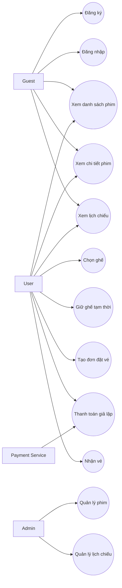
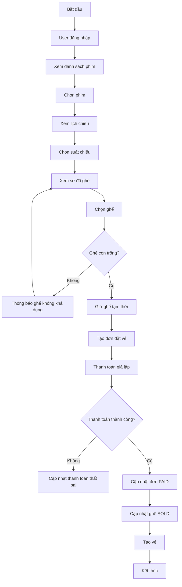
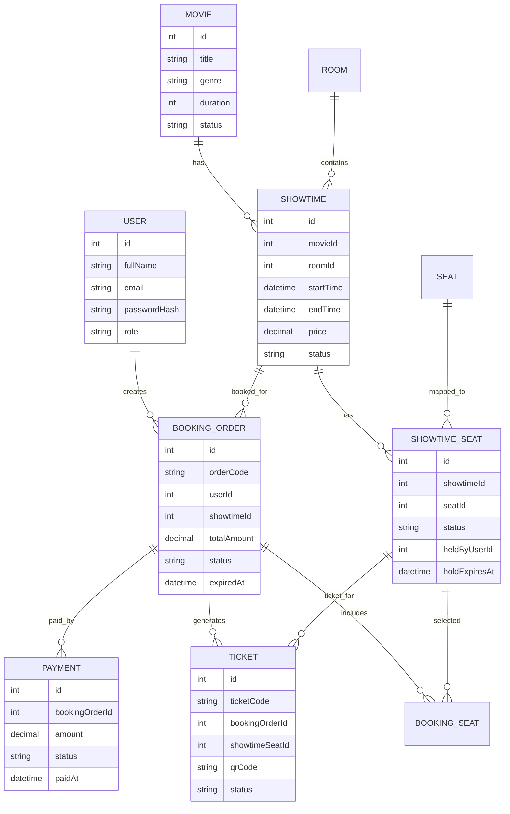
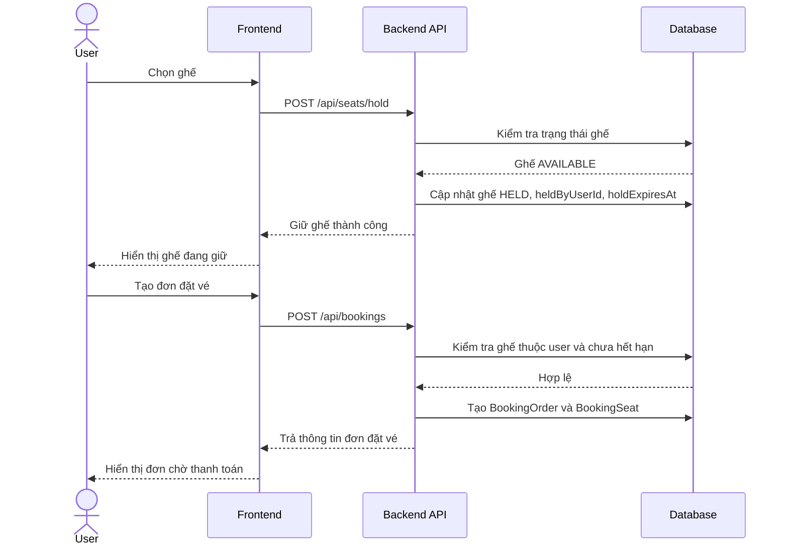

# [BA/DA-Child] Phân tích nghiệp vụ, đặc tả API, sơ đồ và test case

## 1. Thông tin liên kết

- Issue: #32
- Milestone: 3
- Người phụ trách: @Minhhanh-zit
- Phạm vi: Phân tích nghiệp vụ, đặc tả API, sơ đồ hệ thống và test case cho các chức năng backend từ Auth đến Payment.

---

## 2. Mục tiêu

Tài liệu này tổng hợp phần BA/DA cho hệ thống đặt vé xem phim, tập trung vào các chức năng chính trong Milestone 3:

- Đăng ký, đăng nhập và phân quyền.
- Quản lý phim.
- Quản lý lịch chiếu.
- Chọn ghế và giữ ghế tạm thời.
- Tạo đơn đặt vé.
- Thanh toán giả lập và tạo vé.

Mục tiêu của tài liệu là giúp nhóm backend triển khai thống nhất, tránh sai lệch nghiệp vụ giữa các module và làm cơ sở cho kiểm thử bằng Postman hoặc Swagger.

---

## 3. Phân tích tác nhân

| Tác nhân | Mô tả | Chức năng chính |
|---|---|---|
| Guest | Người chưa đăng nhập | Xem phim, xem lịch chiếu, đăng ký, đăng nhập |
| User | Người dùng đã đăng nhập | Chọn ghế, giữ ghế, tạo đơn đặt vé, thanh toán, xem vé |
| Admin | Người quản trị hệ thống | Quản lý phim, quản lý lịch chiếu, kiểm tra dữ liệu đặt vé |
| Payment Service | Dịch vụ thanh toán giả lập | Xác nhận thanh toán thành công hoặc thất bại |
| System | Hệ thống backend | Kiểm tra token, phân quyền, xử lý hết hạn giữ ghế, cập nhật trạng thái |

---

## 4. Phân tích luồng nghiệp vụ

### 4.1. Luồng đăng ký tài khoản

1. Người dùng nhập thông tin đăng ký gồm họ tên, email và mật khẩu.
2. Hệ thống kiểm tra dữ liệu đầu vào.
3. Hệ thống kiểm tra email đã tồn tại hay chưa.
4. Nếu email đã tồn tại, hệ thống trả lỗi.
5. Nếu hợp lệ, hệ thống mã hóa mật khẩu.
6. Hệ thống tạo tài khoản với role mặc định là `USER`.
7. Hệ thống trả thông báo đăng ký thành công.

### 4.2. Luồng đăng nhập

1. Người dùng nhập email và mật khẩu.
2. Hệ thống kiểm tra email có tồn tại không.
3. Hệ thống so sánh mật khẩu nhập vào với mật khẩu đã mã hóa.
4. Nếu sai thông tin, hệ thống trả lỗi đăng nhập.
5. Nếu đúng, hệ thống tạo JWT token.
6. Hệ thống trả về token và thông tin người dùng.

### 4.3. Luồng phân quyền User/Admin

1. Người dùng gửi request kèm token.
2. Hệ thống kiểm tra token hợp lệ.
3. Hệ thống lấy role từ token.
4. Nếu API yêu cầu Admin mà user không phải Admin, hệ thống trả lỗi không có quyền.
5. Nếu quyền hợp lệ, hệ thống cho phép truy cập API.

### 4.4. Luồng quản lý phim

#### Với Guest/User

1. Người dùng truy cập danh sách phim.
2. Hệ thống trả danh sách phim đang hoạt động.
3. Người dùng chọn phim để xem chi tiết.
4. Hệ thống trả thông tin chi tiết phim.
5. Người dùng có thể tìm kiếm phim theo tên hoặc thể loại.

#### Với Admin

1. Admin đăng nhập hệ thống.
2. Admin thêm, sửa hoặc xóa phim.
3. Hệ thống kiểm tra quyền Admin.
4. Hệ thống validate dữ liệu phim.
5. Hệ thống lưu thay đổi vào database.

### 4.5. Luồng quản lý lịch chiếu

1. Người dùng chọn phim.
2. Hệ thống trả danh sách suất chiếu theo phim.
3. Admin có thể thêm, sửa hoặc xóa suất chiếu.
4. Khi thêm hoặc sửa suất chiếu, hệ thống kiểm tra trùng lịch trong cùng phòng.
5. Nếu suất chiếu bị giao thời gian, hệ thống không cho lưu.
6. Nếu hợp lệ, hệ thống lưu lịch chiếu.

Quy tắc kiểm tra trùng lịch:

```text
Trong cùng một phòng chiếu, hai suất chiếu không được giao nhau về thời gian.
Ví dụ:
- Suất A: 18:00 - 20:00
- Suất B: 19:30 - 21:30
=> Bị trùng, không cho tạo.
```

### 4.6. Luồng chọn ghế và giữ ghế

1. User chọn một suất chiếu.
2. Hệ thống trả sơ đồ ghế theo suất chiếu.
3. User chọn ghế muốn đặt.
4. Hệ thống kiểm tra trạng thái ghế.
5. Nếu ghế `AVAILABLE`, hệ thống chuyển ghế sang `HELD`.
6. Hệ thống lưu `heldByUserId` và `holdExpiresAt`.
7. Nếu ghế đã `HELD` bởi người khác và chưa hết hạn, hệ thống chặn giữ ghế.
8. Nếu ghế đã `SOLD`, hệ thống chặn chọn ghế.
9. Nếu ghế `HELD` nhưng đã hết hạn, hệ thống mở lại ghế rồi cho giữ lại.

Trạng thái ghế:

| Trạng thái | Ý nghĩa |
|---|---|
| AVAILABLE | Ghế còn trống |
| HELD | Ghế đang được giữ tạm thời |
| SOLD | Ghế đã bán |
| BLOCKED | Ghế bị khóa, không cho đặt |

### 4.7. Luồng tạo đơn đặt vé

1. User đã giữ ghế thành công.
2. User gửi yêu cầu tạo đơn đặt vé.
3. Hệ thống kiểm tra ghế có đang được giữ bởi đúng user không.
4. Hệ thống kiểm tra ghế chưa hết hạn giữ.
5. Hệ thống tạo `BookingOrder`.
6. Hệ thống tính tổng tiền.
7. Hệ thống lưu danh sách ghế vào `BookingSeat`.
8. Hệ thống tạo mã đơn hàng.
9. Hệ thống đặt trạng thái đơn là `PENDING_PAYMENT`.
10. Hệ thống trả kết quả đơn đặt vé cho frontend.

Trạng thái đơn:

| Trạng thái | Ý nghĩa |
|---|---|
| PENDING_PAYMENT | Đơn đang chờ thanh toán |
| PAID | Đơn đã thanh toán thành công |
| EXPIRED | Đơn đã hết hạn |
| CANCELLED | Đơn bị hủy |

### 4.8. Luồng thanh toán giả lập và tạo vé

1. User tạo yêu cầu thanh toán cho đơn đang chờ thanh toán.
2. Hệ thống kiểm tra đơn tồn tại.
3. Hệ thống kiểm tra đơn thuộc về user hiện tại.
4. Hệ thống kiểm tra đơn đang ở trạng thái `PENDING_PAYMENT`.
5. User chọn thanh toán thành công hoặc không thành công trong luồng demo.
6. Nếu thanh toán thành công:
   - Cập nhật `Payment` thành `SUCCESS`.
   - Cập nhật `BookingOrder` thành `PAID`.
   - Cập nhật ghế thành `SOLD`.
   - Tạo vé cho từng ghế.
7. Nếu thanh toán không thành công:
   - Cập nhật `Payment` thành `FAILED`.
   - Đơn vẫn chờ xử lý hoặc được xử lý theo quy định demo.

---

## 5. Đặc tả API

### 5.1. Auth API

| Chức năng | Method | Endpoint | Quyền | Mô tả |
|---|---|---|---|---|
| Đăng ký | POST | `/api/auth/register` | Public | Tạo tài khoản mới |
| Đăng nhập | POST | `/api/auth/login` | Public | Đăng nhập và nhận token |
| Lấy profile | GET | `/api/auth/profile` | User/Admin | Lấy thông tin người dùng hiện tại |

Request đăng ký:

```json
{
  "fullName": "Nguyen Van A",
  "email": "user@example.com",
  "password": "123456"
}
```

Response đăng ký thành công:

```json
{
  "message": "Đăng ký thành công",
  "data": {
    "id": 1,
    "fullName": "Nguyen Van A",
    "email": "user@example.com",
    "role": "USER"
  }
}
```

Request đăng nhập:

```json
{
  "email": "user@example.com",
  "password": "123456"
}
```

Response đăng nhập thành công:

```json
{
  "message": "Đăng nhập thành công",
  "token": "jwt_token_here",
  "user": {
    "id": 1,
    "fullName": "Nguyen Van A",
    "email": "user@example.com",
    "role": "USER"
  }
}
```

### 5.2. Movie API

| Chức năng | Method | Endpoint | Quyền | Mô tả |
|---|---|---|---|---|
| Lấy danh sách phim | GET | `/api/movies` | Public | Lấy danh sách phim |
| Lấy chi tiết phim | GET | `/api/movies/:id` | Public | Lấy thông tin chi tiết phim |
| Tìm kiếm phim | GET | `/api/movies/search?keyword=` | Public | Tìm phim theo từ khóa |
| Thêm phim | POST | `/api/movies` | Admin | Thêm phim mới |
| Sửa phim | PUT | `/api/movies/:id` | Admin | Cập nhật phim |
| Xóa phim | DELETE | `/api/movies/:id` | Admin | Xóa hoặc ẩn phim |

### 5.3. Showtime API

| Chức năng | Method | Endpoint | Quyền | Mô tả |
|---|---|---|---|---|
| Lấy lịch chiếu theo phim | GET | `/api/showtimes/movie/:movieId` | Public | Xem lịch chiếu của một phim |
| Lấy lịch chiếu theo phòng | GET | `/api/showtimes/room/:roomId` | Admin | Xem lịch chiếu theo phòng |
| Thêm suất chiếu | POST | `/api/showtimes` | Admin | Thêm suất chiếu |
| Sửa suất chiếu | PUT | `/api/showtimes/:id` | Admin | Sửa suất chiếu |
| Xóa suất chiếu | DELETE | `/api/showtimes/:id` | Admin | Xóa suất chiếu |

### 5.4. Seat Hold API

| Chức năng | Method | Endpoint | Quyền | Mô tả |
|---|---|---|---|---|
| Lấy sơ đồ ghế | GET | `/api/showtimes/:id/seats` | User/Admin | Xem sơ đồ ghế theo suất chiếu |
| Giữ ghế | POST | `/api/seats/hold` | User | Giữ ghế tạm thời |
| Mở ghế hết hạn | POST | `/api/seats/release-expired` | System/Admin | Mở lại ghế hết hạn giữ |

Request giữ ghế:

```json
{
  "showtimeId": 1,
  "seatIds": [1, 2, 3]
}
```

### 5.5. Booking API

| Chức năng | Method | Endpoint | Quyền | Mô tả |
|---|---|---|---|---|
| Tạo đơn đặt vé | POST | `/api/bookings` | User | Tạo đơn từ ghế đã giữ |
| Lấy chi tiết đơn | GET | `/api/bookings/:id` | User/Admin | Xem chi tiết đơn |
| Lấy đơn của tôi | GET | `/api/bookings/my` | User | Xem lịch sử đơn đặt vé |
| Xử lý đơn hết hạn | POST | `/api/bookings/:id/expire` | System/Admin | Cập nhật đơn hết hạn |

### 5.6. Payment API

| Chức năng | Method | Endpoint | Quyền | Mô tả |
|---|---|---|---|---|
| Tạo yêu cầu thanh toán | POST | `/api/payments/create` | User | Tạo payment cho đơn |
| Xác nhận thành công | POST | `/api/payments/success` | User/Admin | Thanh toán thành công |
| Xác nhận không thành công | POST | `/api/payments/failed` | User/Admin | Thanh toán không thành công |

---

## 6. Sơ đồ hệ thống

### 6.1. Use Case Diagram tổng quát



### 6.2. Activity Diagram quy trình đặt vé



### 6.3. ERD các bảng chính



### 6.4. Sequence Diagram giữ ghế và tạo đơn



---

## 7. Test case

| Mã TC | Chức năng | Dữ liệu / Điều kiện | Kết quả mong đợi |
|---|---|---|---|
| TC01 | Đăng ký | Email chưa tồn tại | Tạo tài khoản thành công |
| TC02 | Đăng ký | Email đã tồn tại | Trả lỗi email đã được sử dụng |
| TC03 | Đăng nhập | Email/mật khẩu đúng | Trả JWT token |
| TC04 | Đăng nhập | Sai mật khẩu | Trả lỗi đăng nhập |
| TC05 | Phân quyền | User gọi API Admin | Trả lỗi không có quyền |
| TC06 | Movie | Lấy danh sách phim | Trả danh sách phim |
| TC07 | Movie | Lấy chi tiết phim tồn tại | Trả chi tiết phim |
| TC08 | Movie | Admin thêm phim | Thêm phim thành công |
| TC09 | Movie | User thêm phim | Bị chặn quyền |
| TC10 | Showtime | Thêm suất chiếu không trùng | Tạo suất chiếu thành công |
| TC11 | Showtime | Thêm suất chiếu trùng phòng và thời gian | Trả lỗi trùng lịch |
| TC12 | Seat Hold | User giữ ghế AVAILABLE | Ghế chuyển sang HELD |
| TC13 | Seat Hold | Hai user giữ cùng ghế | Chỉ một user giữ thành công |
| TC14 | Seat Hold | Ghế đã SOLD | Không cho giữ ghế |
| TC15 | Seat Hold | Ghế HELD hết hạn | Ghế được mở lại |
| TC16 | Booking | Tạo đơn từ ghế đang giữ hợp lệ | Tạo đơn PENDING_PAYMENT |
| TC17 | Booking | Tạo đơn từ ghế hết hạn giữ | Trả lỗi |
| TC18 | Payment | Thanh toán thành công | Đơn PAID, ghế SOLD, tạo Ticket |
| TC19 | Payment | Thanh toán không thành công | Payment FAILED |
| TC20 | Ticket | Sau thanh toán thành công | Trả mã vé hoặc QR code |

---

## 8. Kết quả cần bàn giao

- Tài liệu phân tích nghiệp vụ cho Milestone 3.
- Bảng đặc tả API cho các module chính.
- Use Case Diagram tổng quát.
- Activity Diagram quy trình đặt vé.
- ERD các bảng chính.
- Sequence Diagram luồng giữ ghế và tạo đơn.
- Bảng test case phục vụ kiểm thử Postman hoặc Swagger.

---

## 9. Kết luận

Phần BA/DA trong Milestone 3 giúp thống nhất nghiệp vụ giữa các thành viên backend. Các module Auth, Movie, Showtime, Seat Hold, Booking và Payment có quan hệ chặt chẽ với nhau nên cần đặc tả rõ luồng xử lý, trạng thái dữ liệu và điều kiện kiểm tra để tránh lỗi đặt trùng ghế, sai phân quyền hoặc sai trạng thái đơn vé.
