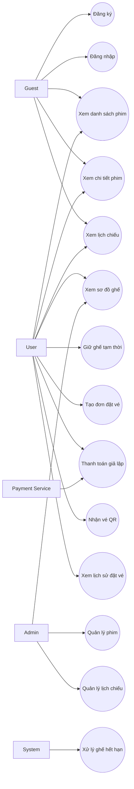
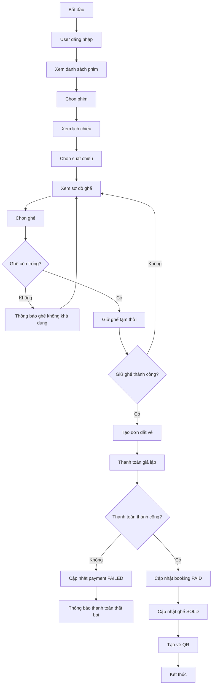
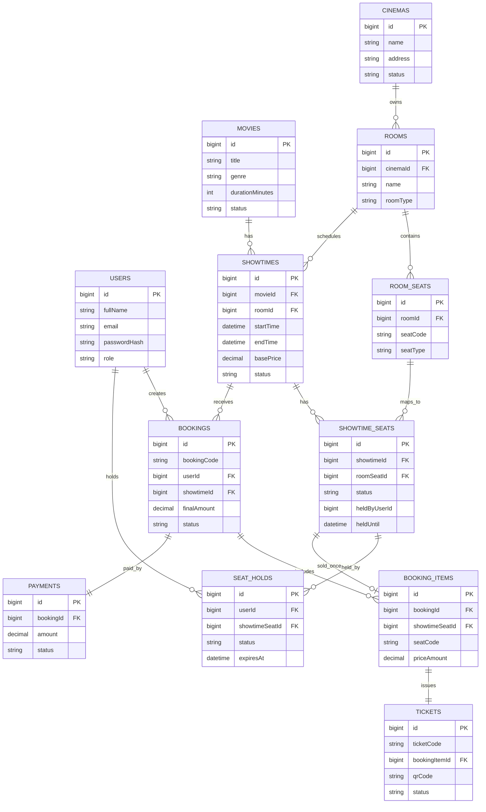
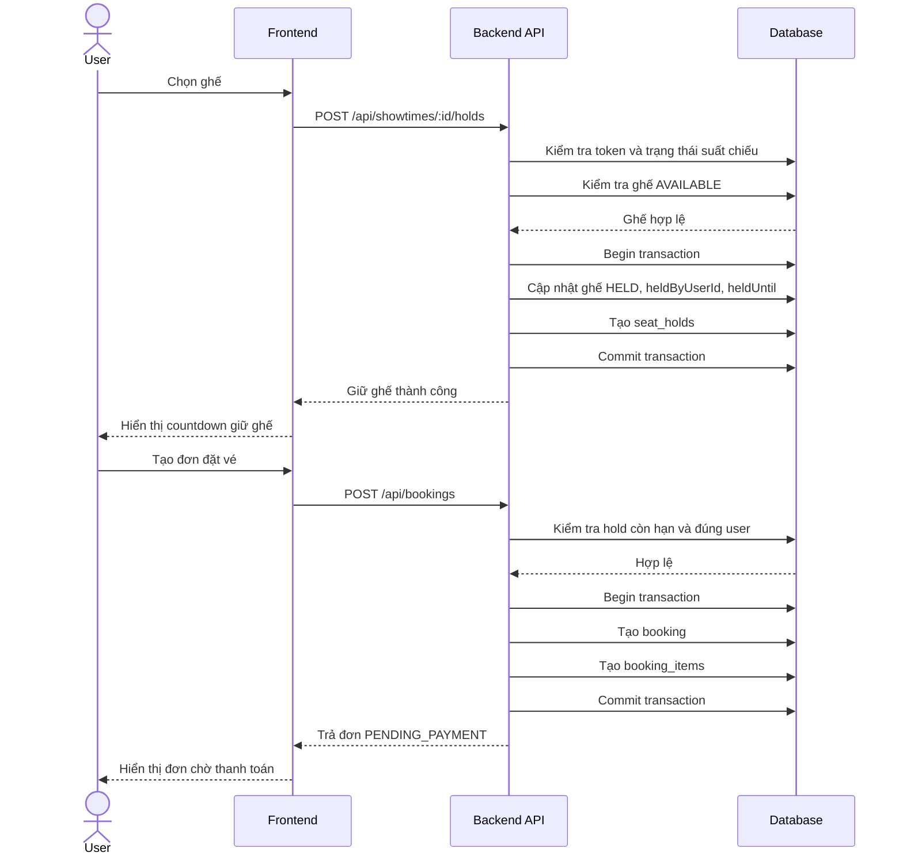
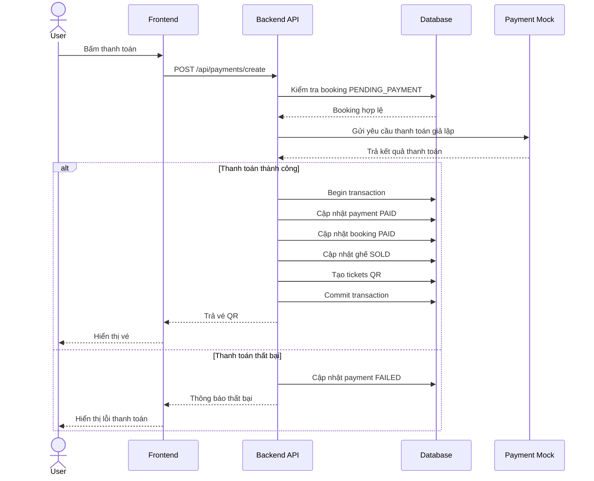

# [BA/DA-Child] Phân tích nghiệp vụ, đặc tả API, sơ đồ và test case

## 1. Thông tin liên kết

- Issue: #32
- Milestone: 3
- Người phụ trách: @Minhhanh-zit
- Vai trò: BA/DA hỗ trợ các issue backend từ Auth đến Payment.
- Phạm vi: Phân tích nghiệp vụ, đặc tả API, sơ đồ hệ thống, ERD, sequence diagram và test case cho các chức năng backend chính.

---

## 2. Mục tiêu

Tài liệu này tổng hợp phần BA/DA cho hệ thống đặt vé xem phim **CineHunt MVP**, tập trung vào các chức năng chính trong Milestone 3:

- Đăng ký, đăng nhập và phân quyền.
- Quản lý phim.
- Quản lý lịch chiếu.
- Xem sơ đồ ghế theo suất chiếu.
- Chọn ghế và giữ ghế tạm thời.
- Tạo đơn đặt vé.
- Thanh toán giả lập.
- Tạo vé điện tử QR sau khi thanh toán thành công.

Mục tiêu của tài liệu:

- Giúp backend triển khai đúng nghiệp vụ.
- Giúp frontend biết API cần gọi và dữ liệu cần gửi.
- Giúp tester kiểm thử bằng Postman hoặc Swagger.
- Tránh sai lệch giữa thiết kế, API và database.
- Hạn chế lỗi đặt trùng ghế, sai phân quyền, sai trạng thái đơn vé.

---

## 3. Phân tích tác nhân

| Tác nhân | Mô tả | Chức năng chính |
|---|---|---|
| Guest | Người chưa đăng nhập | Xem phim, xem lịch chiếu, đăng ký, đăng nhập |
| User | Người dùng đã đăng nhập | Chọn ghế, giữ ghế, tạo đơn đặt vé, thanh toán, xem vé |
| Admin | Người quản trị hệ thống | Quản lý phim, lịch chiếu, kiểm tra dữ liệu đặt vé |
| Payment Service | Thanh toán giả lập | Xác nhận thanh toán thành công hoặc thất bại |
| System | Hệ thống backend | Kiểm tra token, phân quyền, xử lý giữ ghế hết hạn, cập nhật trạng thái |

---

## 4. Phân tích luồng nghiệp vụ

### 4.1. Luồng đăng ký tài khoản

1. Guest nhập họ tên, email, số điện thoại và mật khẩu.
2. Hệ thống kiểm tra dữ liệu bắt buộc.
3. Hệ thống kiểm tra định dạng email.
4. Hệ thống kiểm tra email/số điện thoại đã tồn tại chưa.
5. Nếu dữ liệu không hợp lệ, hệ thống trả lỗi.
6. Nếu hợp lệ, hệ thống mã hóa mật khẩu.
7. Hệ thống tạo tài khoản với role mặc định là `USER`.
8. Hệ thống trả thông báo đăng ký thành công.

### 4.2. Luồng đăng nhập

1. User nhập email và mật khẩu.
2. Hệ thống kiểm tra email có tồn tại không.
3. Hệ thống so sánh mật khẩu với `password_hash`.
4. Nếu sai thông tin, hệ thống trả lỗi `401 Unauthorized`.
5. Nếu tài khoản bị khóa, hệ thống trả lỗi `403 Forbidden`.
6. Nếu hợp lệ, hệ thống tạo JWT token.
7. Hệ thống trả token và thông tin người dùng.

### 4.3. Luồng phân quyền User/Admin

1. Client gửi request kèm token.
2. Hệ thống kiểm tra token.
3. Hệ thống lấy role từ token.
4. Nếu API yêu cầu Admin mà user không phải Admin, hệ thống trả lỗi `403 Forbidden`.
5. Nếu quyền hợp lệ, hệ thống cho phép xử lý request.

### 4.4. Luồng quản lý phim

#### Guest/User

1. Người dùng truy cập danh sách phim.
2. Hệ thống trả danh sách phim đang hiển thị.
3. Người dùng tìm kiếm/lọc phim.
4. Người dùng chọn phim để xem chi tiết.
5. Hệ thống trả chi tiết phim.

#### Admin

1. Admin đăng nhập.
2. Admin thêm/sửa/xóa hoặc ẩn phim.
3. Hệ thống kiểm tra quyền Admin.
4. Hệ thống validate dữ liệu phim.
5. Hệ thống lưu thay đổi.
6. Hệ thống trả kết quả xử lý.

### 4.5. Luồng quản lý lịch chiếu

1. Admin chọn phim, rạp, phòng và thời gian chiếu.
2. Hệ thống kiểm tra dữ liệu đầu vào.
3. Hệ thống kiểm tra phim/phòng còn hoạt động.
4. Hệ thống kiểm tra trùng lịch trong cùng phòng.
5. Nếu trùng lịch, hệ thống trả lỗi `409 Conflict`.
6. Nếu hợp lệ, hệ thống tạo suất chiếu.
7. Hệ thống sinh danh sách `showtime_seats` từ sơ đồ ghế gốc của phòng.

Quy tắc kiểm tra trùng lịch:

```text
Trong cùng một phòng chiếu, hai suất chiếu không được giao nhau về thời gian.
Điều kiện trùng:
newStart < oldEnd AND newEnd > oldStart
```

### 4.6. Luồng xem sơ đồ ghế

1. User chọn suất chiếu.
2. Hệ thống kiểm tra suất chiếu tồn tại.
3. Hệ thống lấy danh sách ghế từ `showtime_seats`.
4. Hệ thống trả trạng thái từng ghế: `AVAILABLE`, `HELD`, `SOLD`, `BLOCKED`.
5. Frontend hiển thị sơ đồ ghế.

### 4.7. Luồng chọn ghế và giữ ghế tạm thời

1. User chọn một hoặc nhiều ghế.
2. Client gửi danh sách `showtimeSeatIds` lên API giữ ghế.
3. Hệ thống kiểm tra user đã đăng nhập.
4. Hệ thống kiểm tra suất chiếu còn mở bán.
5. Hệ thống kiểm tra các ghế có trạng thái `AVAILABLE`.
6. Hệ thống khóa/cập nhật ghế trong transaction.
7. Ghế chuyển sang `HELD`.
8. Hệ thống lưu `heldByUserId` và `holdExpiresAt`.
9. Nếu ghế đã bị giữ bởi người khác, hệ thống trả lỗi `409 Conflict`.
10. Nếu ghế đã bán, hệ thống trả lỗi không cho giữ.

Trạng thái ghế:

| Trạng thái | Ý nghĩa |
|---|---|
| AVAILABLE | Ghế còn trống |
| HELD | Ghế đang được giữ tạm thời |
| SOLD | Ghế đã bán |
| BLOCKED | Ghế bị khóa, không cho đặt |

### 4.8. Luồng tạo đơn đặt vé

1. User đã giữ ghế thành công.
2. User gửi yêu cầu tạo đơn đặt vé.
3. Hệ thống kiểm tra các ghế đang `HELD`.
4. Hệ thống kiểm tra ghế thuộc đúng user.
5. Hệ thống kiểm tra ghế chưa hết hạn giữ.
6. Hệ thống tự tính tổng tiền.
7. Hệ thống tạo `BookingOrder` với trạng thái `PENDING_PAYMENT`.
8. Hệ thống tạo các dòng chi tiết `BookingSeat` hoặc `BookingItem`.
9. Hệ thống trả mã đơn và hạn thanh toán.

Trạng thái đơn:

| Trạng thái | Ý nghĩa |
|---|---|
| PENDING_PAYMENT | Đơn đang chờ thanh toán |
| PAID | Đơn đã thanh toán thành công |
| EXPIRED | Đơn đã hết hạn |
| CANCELLED | Đơn bị hủy |
| REFUNDED | Đơn đã hoàn tiền |

### 4.9. Luồng thanh toán giả lập và tạo vé

1. User chọn thanh toán cho đơn đang `PENDING_PAYMENT`.
2. Hệ thống kiểm tra đơn tồn tại.
3. Hệ thống kiểm tra đơn thuộc về user hiện tại.
4. Hệ thống kiểm tra đơn chưa hết hạn.
5. User chọn kết quả thanh toán trong môi trường demo.
6. Nếu thanh toán thành công:
   - Cập nhật `payments.status = PAID`.
   - Cập nhật `bookings.status = PAID`.
   - Cập nhật `showtime_seats.status = SOLD`.
   - Tạo vé cho từng ghế.
7. Nếu thanh toán thất bại:
   - Cập nhật `payments.status = FAILED`.
   - Đơn vẫn chờ thanh toán hoặc chuyển thất bại theo quy định demo.

---

## 5. Đặc tả API

### 5.1. Quy ước response chung

```json
{
  "success": true,
  "message": "Xử lý thành công",
  "data": {},
  "errors": null
}
```

### 5.2. Mã lỗi phổ biến

| HTTP Status | Ý nghĩa | Ví dụ |
|---|---|---|
| 200 | Thành công | Lấy dữ liệu thành công |
| 201 | Tạo mới thành công | Đăng ký, tạo booking |
| 400 | Dữ liệu không hợp lệ | Thiếu email, sai format |
| 401 | Chưa đăng nhập | Token thiếu/sai |
| 403 | Không có quyền | User gọi API Admin |
| 404 | Không tìm thấy dữ liệu | Không tìm thấy phim/suất chiếu |
| 409 | Xung đột dữ liệu | Ghế đã bị giữ hoặc đã bán |
| 500 | Lỗi server | Lỗi xử lý phía backend |

### 5.3. Auth API

| Chức năng | Method | Endpoint | Quyền | Mô tả |
|---|---|---|---|---|
| Đăng ký | POST | `/api/auth/register` | Public | Tạo tài khoản mới |
| Đăng nhập | POST | `/api/auth/login` | Public | Đăng nhập và nhận token |
| Lấy profile | GET | `/api/auth/profile` | User/Admin | Lấy thông tin người dùng hiện tại |
| Đăng xuất | POST | `/api/auth/logout` | User/Admin | Đăng xuất khỏi hệ thống |

Request đăng ký:

```json
{
  "fullName": "Nguyen Van A",
  "email": "user@example.com",
  "phone": "0987654321",
  "password": "123456"
}
```

Response đăng ký thành công:

```json
{
  "success": true,
  "message": "Đăng ký thành công",
  "data": {
    "id": 1,
    "fullName": "Nguyen Van A",
    "email": "user@example.com",
    "role": "USER",
    "status": "ACTIVE"
  },
  "errors": null
}
```

Request đăng nhập:

```json
{
  "email": "user@example.com",
  "password": "123456"
}
```

Response đăng nhập thành công:

```json
{
  "success": true,
  "message": "Đăng nhập thành công",
  "data": {
    "accessToken": "jwt_access_token",
    "user": {
      "id": 1,
      "fullName": "Nguyen Van A",
      "email": "user@example.com",
      "role": "USER"
    }
  },
  "errors": null
}
```

### 5.4. Movie API

| Chức năng | Method | Endpoint | Quyền | Mô tả |
|---|---|---|---|---|
| Lấy danh sách phim | GET | `/api/movies` | Public | Lấy danh sách phim |
| Lấy chi tiết phim | GET | `/api/movies/:id` | Public | Lấy thông tin chi tiết phim |
| Tìm kiếm phim | GET | `/api/movies?keyword=` | Public | Tìm phim theo từ khóa |
| Thêm phim | POST | `/api/movies` | Admin | Thêm phim mới |
| Sửa phim | PUT | `/api/movies/:id` | Admin | Cập nhật phim |
| Xóa/ẩn phim | DELETE | `/api/movies/:id` | Admin | Xóa mềm hoặc ẩn phim |

Request thêm phim:

```json
{
  "title": "Doraemon Movie",
  "description": "Nội dung phim",
  "genre": "Animation",
  "durationMinutes": 110,
  "releaseDate": "2026-06-01",
  "ageRating": "P",
  "posterUrl": "https://example.com/poster.jpg",
  "status": "NOW_SHOWING"
}
```

Response thêm phim:

```json
{
  "success": true,
  "message": "Thêm phim thành công",
  "data": {
    "id": 1,
    "title": "Doraemon Movie",
    "status": "NOW_SHOWING"
  },
  "errors": null
}
```

### 5.5. Showtime API

| Chức năng | Method | Endpoint | Quyền | Mô tả |
|---|---|---|---|---|
| Lấy lịch chiếu | GET | `/api/showtimes` | Public | Lọc theo phim, rạp, ngày |
| Lấy lịch chiếu theo phim | GET | `/api/showtimes?movieId=1` | Public | Xem lịch chiếu của một phim |
| Lấy lịch chiếu theo phòng | GET | `/api/showtimes?roomId=1` | Admin | Xem lịch chiếu theo phòng |
| Thêm suất chiếu | POST | `/api/showtimes` | Admin | Thêm suất chiếu |
| Sửa suất chiếu | PUT | `/api/showtimes/:id` | Admin | Sửa suất chiếu |
| Xóa suất chiếu | DELETE | `/api/showtimes/:id` | Admin | Xóa/đóng suất chiếu |

Request thêm suất chiếu:

```json
{
  "movieId": 1,
  "cinemaId": 1,
  "roomId": 1,
  "startTime": "2026-06-10T19:00:00",
  "endTime": "2026-06-10T21:00:00",
  "basePrice": 90000,
  "status": "OPEN_FOR_SALE"
}
```

Response thêm suất chiếu:

```json
{
  "success": true,
  "message": "Tạo suất chiếu thành công",
  "data": {
    "id": 1,
    "movieId": 1,
    "roomId": 1,
    "startTime": "2026-06-10T19:00:00",
    "status": "OPEN_FOR_SALE"
  },
  "errors": null
}
```

### 5.6. Seat Hold API

| Chức năng | Method | Endpoint | Quyền | Mô tả |
|---|---|---|---|---|
| Lấy sơ đồ ghế | GET | `/api/showtimes/:showtimeId/seats` | Public/User | Xem sơ đồ ghế theo suất chiếu |
| Giữ ghế | POST | `/api/showtimes/:showtimeId/holds` | User | Giữ ghế tạm thời |
| Hủy giữ ghế | DELETE | `/api/holds/:holdId` | User | Hủy lượt giữ ghế |
| Mở ghế hết hạn | POST | `/api/seats/release-expired` | System/Admin | Mở lại ghế hết hạn giữ |

Request giữ ghế:

```json
{
  "showtimeSeatIds": [101, 102]
}
```

Response giữ ghế thành công:

```json
{
  "success": true,
  "message": "Giữ ghế thành công",
  "data": {
    "showtimeId": 1,
    "heldSeats": [
      {
        "showtimeSeatId": 101,
        "seatCode": "A1",
        "status": "HELD"
      },
      {
        "showtimeSeatId": 102,
        "seatCode": "A2",
        "status": "HELD"
      }
    ],
    "holdExpiresAt": "2026-06-10T18:55:00",
    "holdDurationSeconds": 300
  },
  "errors": null
}
```

Response lỗi ghế đã bị giữ:

```json
{
  "success": false,
  "message": "Một hoặc nhiều ghế đã được giữ bởi người khác",
  "data": null,
  "errors": [
    {
      "field": "showtimeSeatIds",
      "code": "SEAT_ALREADY_HELD"
    }
  ]
}
```

### 5.7. Booking API

| Chức năng | Method | Endpoint | Quyền | Mô tả |
|---|---|---|---|---|
| Tạo đơn đặt vé | POST | `/api/bookings` | User | Tạo đơn từ ghế đã giữ |
| Lấy chi tiết đơn | GET | `/api/bookings/:id` | User/Admin | Xem chi tiết đơn |
| Lấy đơn của tôi | GET | `/api/bookings/my` | User | Xem lịch sử đặt vé |
| Xử lý đơn hết hạn | POST | `/api/bookings/:id/expire` | System/Admin | Cập nhật đơn hết hạn |

Request tạo booking:

```json
{
  "showtimeId": 1,
  "showtimeSeatIds": [101, 102],
  "holdToken": "hold_token_demo"
}
```

Response tạo booking:

```json
{
  "success": true,
  "message": "Tạo đơn đặt vé thành công",
  "data": {
    "bookingId": 1,
    "bookingCode": "BK202606100001",
    "status": "PENDING_PAYMENT",
    "totalAmount": 180000,
    "discountAmount": 0,
    "finalAmount": 180000,
    "expiresAt": "2026-06-10T19:00:00"
  },
  "errors": null
}
```

### 5.8. Payment API

| Chức năng | Method | Endpoint | Quyền | Mô tả |
|---|---|---|---|---|
| Tạo yêu cầu thanh toán | POST | `/api/payments/create` | User | Tạo payment cho đơn |
| Xác nhận thành công | POST | `/api/payments/success` | User/Admin | Thanh toán thành công |
| Xác nhận không thành công | POST | `/api/payments/failed` | User/Admin | Thanh toán không thành công |
| Lấy kết quả thanh toán | GET | `/api/payments/:id` | User/Admin | Xem trạng thái payment |

Request tạo payment:

```json
{
  "bookingId": 1,
  "paymentMethod": "MOCK"
}
```

Response thanh toán thành công:

```json
{
  "success": true,
  "message": "Thanh toán thành công",
  "data": {
    "paymentId": 1,
    "bookingId": 1,
    "paymentStatus": "PAID",
    "bookingStatus": "PAID",
    "tickets": [
      {
        "ticketCode": "TK202606100001",
        "seatCode": "A1",
        "qrCode": "QR_DATA_DEMO"
      }
    ]
  },
  "errors": null
}
```

---

## 6. Sơ đồ hệ thống

### 6.1. Use Case Diagram tổng quát



### 6.2. Activity Diagram quy trình đặt vé



### 6.3. ERD các bảng chính



### 6.4. Sequence Diagram giữ ghế và tạo đơn



### 6.5. Sequence Diagram thanh toán và phát hành vé



---

## 7. Test case kiểm thử Postman/Swagger

> Ghi chú: Các test case dưới đây là bộ kịch bản kiểm thử chuẩn để chạy bằng Postman hoặc Swagger sau khi backend API sẵn sàng. Cột `Status` dùng để theo dõi khi thực thi test, không giả lập kết quả chạy thật nếu chưa có backend.

| Mã TC | Module | Precondition | Steps | Expected Result | Status | Tool |
|---|---|---|---|---|---|---|
| TC01 | Auth | Email chưa tồn tại | Gửi POST `/api/auth/register` với dữ liệu hợp lệ | Tạo tài khoản thành công, role USER | Ready | Postman/Swagger |
| TC02 | Auth | Email đã tồn tại | Gửi POST `/api/auth/register` với email trùng | Trả lỗi 409 hoặc thông báo email đã tồn tại | Ready | Postman/Swagger |
| TC03 | Auth | Tài khoản tồn tại | Gửi POST `/api/auth/login` đúng email/mật khẩu | Trả JWT token và thông tin user | Ready | Postman/Swagger |
| TC04 | Auth | Tài khoản tồn tại | Gửi POST `/api/auth/login` sai mật khẩu | Trả lỗi 401 | Ready | Postman/Swagger |
| TC05 | Authorization | User thường đã đăng nhập | User gọi API Admin thêm phim | Trả lỗi 403 Forbidden | Ready | Postman/Swagger |
| TC06 | Movie | Có dữ liệu phim | Gửi GET `/api/movies` | Trả danh sách phim | Ready | Postman/Swagger |
| TC07 | Movie | Movie ID tồn tại | Gửi GET `/api/movies/:id` | Trả chi tiết phim | Ready | Postman/Swagger |
| TC08 | Movie | Admin đã đăng nhập | Gửi POST `/api/movies` với dữ liệu hợp lệ | Thêm phim thành công | Ready | Postman/Swagger |
| TC09 | Movie | Admin đã đăng nhập | Gửi POST `/api/movies` thiếu title | Trả lỗi validate 400 | Ready | Postman/Swagger |
| TC10 | Showtime | Admin đã đăng nhập, phòng trống lịch | Gửi POST `/api/showtimes` không trùng thời gian | Tạo suất chiếu thành công | Ready | Postman/Swagger |
| TC11 | Showtime | Đã có suất chiếu trong phòng | Gửi POST `/api/showtimes` bị giao thời gian | Trả lỗi 409 Conflict | Ready | Postman/Swagger |
| TC12 | Seat Map | Showtime tồn tại | Gửi GET `/api/showtimes/:id/seats` | Trả sơ đồ ghế và trạng thái | Ready | Postman/Swagger |
| TC13 | Seat Hold | User đăng nhập, ghế AVAILABLE | Gửi POST `/api/showtimes/:id/holds` | Ghế chuyển HELD, trả `holdExpiresAt` | Ready | Postman/Swagger |
| TC14 | Seat Hold | Ghế đã HELD bởi user khác | User khác gửi request giữ cùng ghế | Trả lỗi 409 Conflict | Ready | Postman/Swagger |
| TC15 | Seat Hold | Ghế SOLD | Gửi request giữ ghế SOLD | Không cho giữ ghế | Ready | Postman/Swagger |
| TC16 | Seat Hold | Ghế HELD đã hết hạn | Gọi xử lý release expired | Ghế chuyển AVAILABLE | Ready | Postman/Swagger |
| TC17 | Booking | User giữ ghế hợp lệ | Gửi POST `/api/bookings` | Tạo đơn `PENDING_PAYMENT` | Ready | Postman/Swagger |
| TC18 | Booking | Hold đã hết hạn | Gửi POST `/api/bookings` | Trả lỗi ghế hết hạn giữ | Ready | Postman/Swagger |
| TC19 | Payment | Booking PENDING_PAYMENT | Gửi POST `/api/payments/success` | Payment PAID, Booking PAID, ghế SOLD | Ready | Postman/Swagger |
| TC20 | Payment | Booking PENDING_PAYMENT | Gửi POST `/api/payments/failed` | Payment FAILED | Ready | Postman/Swagger |
| TC21 | Ticket | Payment đã PAID | Gọi API lấy vé | Trả ticketCode và QR code | Ready | Postman/Swagger |
| TC22 | Security | Không có token | Gọi API cần User | Trả lỗi 401 Unauthorized | Ready | Postman/Swagger |
| TC23 | Booking | User A có booking | User B xem booking của User A | Trả lỗi 403 hoặc 404 | Ready | Postman/Swagger |
| TC24 | Payment | Booking đã PAID | Gọi lại thanh toán thành công | Không cho thanh toán lại, trả lỗi conflict | Ready | Postman/Swagger |

---

## 8. Checklist bàn giao

- [x] Có phân tích tác nhân.
- [x] Có phân tích luồng nghiệp vụ Auth.
- [x] Có phân tích luồng nghiệp vụ Movie.
- [x] Có phân tích luồng nghiệp vụ Showtime.
- [x] Có phân tích luồng nghiệp vụ Seat Map và Seat Hold.
- [x] Có phân tích luồng nghiệp vụ Booking.
- [x] Có phân tích luồng nghiệp vụ Payment.
- [x] Có quy ước response chung.
- [x] Có bảng mã lỗi phổ biến.
- [x] Có đặc tả API cho Auth, Movie, Showtime, Seat Hold, Booking, Payment.
- [x] Có request/response mẫu cho các API quan trọng.
- [x] Có Use Case Diagram tổng quát.
- [x] Có Activity Diagram quy trình đặt vé.
- [x] Có ERD các bảng chính.
- [x] Có Sequence Diagram giữ ghế và tạo đơn.
- [x] Có Sequence Diagram thanh toán và phát hành vé.
- [x] Có ít nhất 20 test case kiểm thử.
- [x] Test case có precondition, steps, expected result, status và tool.
- [x] Tài liệu có thể dùng làm cơ sở triển khai backend và kiểm thử API.

---

## 9. Acceptance Criteria

Issue được xem là hoàn thành khi:

- [x] Tài liệu BA/DA mô tả đầy đủ tác nhân chính.
- [x] Tài liệu mô tả đầy đủ luồng nghiệp vụ từ Auth đến Payment.
- [x] API có method, endpoint, quyền truy cập và mô tả.
- [x] Các API quan trọng có request body và response mẫu.
- [x] Có quy ước response chung và mã lỗi phổ biến.
- [x] Có Use Case Diagram tổng quát.
- [x] Có Activity Diagram quy trình đặt vé.
- [x] Có ERD các bảng chính.
- [x] Có Sequence Diagram cho giữ ghế và tạo đơn.
- [x] Có Sequence Diagram cho thanh toán và phát hành vé.
- [x] Có tối thiểu 20 test case.
- [x] Test case có precondition, steps, expected result, status và tool.
- [x] Nội dung đủ để backend triển khai các module Auth, Movie, Showtime, Seat, Booking, Payment.
- [x] Nội dung đủ để tester tạo collection Postman hoặc kiểm thử bằng Swagger.

---

## 10. Minh chứng hoàn thành

- Đã hoàn thành tài liệu phân tích nghiệp vụ.
- Đã hoàn thành đặc tả API cho các module backend chính.
- Đã bổ sung request/response cho API quan trọng.
- Đã bổ sung Use Case Diagram tổng quát.
- Đã bổ sung Activity Diagram quy trình đặt vé.
- Đã bổ sung ERD các bảng chính.
- Đã bổ sung Sequence Diagram giữ ghế và tạo đơn.
- Đã bổ sung Sequence Diagram thanh toán và phát hành vé.
- Đã bổ sung bộ test case kiểm thử Postman/Swagger ở mức thiết kế.

---

## 11. Kết luận

Phần BA/DA trong Milestone 3 đã đủ điều kiện bàn giao cho nhóm backend và tester. Tài liệu giúp thống nhất nghiệp vụ giữa các module Auth, Movie, Showtime, Seat Hold, Booking và Payment, đồng thời làm cơ sở để triển khai API, viết test case và kiểm thử bằng Postman hoặc Swagger.

Lưu ý: Kết quả chạy test thực tế cần được cập nhật sau khi backend API hoàn thiện và có môi trường chạy ổn định.
