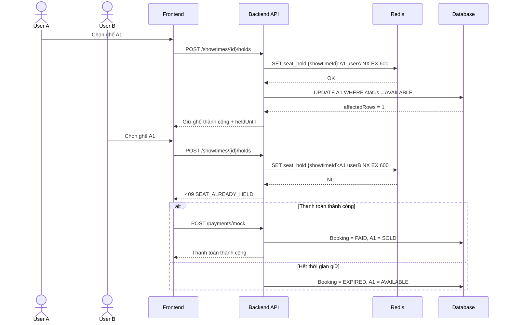

# [Ticket Hunting] Thiết kế luồng săn vé xem phim

## Thông tin chung

- **Issue:** [#69](https://github.com/Minhhanh-zit/CNPM/issues/69)
- **Người phụ trách:** BA/DA – Minhhanh-zit
- **Hệ thống:** CineHunt
- **Mục tiêu:** Thiết kế luồng nghiệp vụ săn vé khi nhiều người dùng cùng chọn ghế, làm căn cứ thống nhất cho frontend, backend và kiểm thử.

## Bằng chứng

- **Tài liệu:** [p21.md](https://github.com/Minhhanh-zit/CNPM/blob/main/.github/Tu%E1%BA%A7n%205/%5BTicket%20Hunting%5D%20Thi%E1%BA%BFt%20k%E1%BA%BF%20lu%E1%BB%93ng%20s%C4%83n%20v%C3%A9%20xem%20phim/p21.md)
- **Commit nội dung:** [80a33b6b7e145418cf167cc19a698d1a53b38532](https://github.com/Minhhanh-zit/CNPM/commit/80a33b6b7e145418cf167cc19a698d1a53b38532)
- **Commit hoàn thiện:** [f280f1745401f0fb7c2cb8c6dc25c5274e4cd868](https://github.com/Minhhanh-zit/CNPM/commit/f280f1745401f0fb7c2cb8c6dc25c5274e4cd868)

---

## 1. Phạm vi

Tài liệu bao gồm:

- Thời điểm mở và đóng bán vé.
- Điều kiện truy cập màn hình chọn ghế.
- Trạng thái ghế theo suất chiếu.
- Thời gian và giới hạn giữ ghế.
- Xử lý nhiều user cùng chọn một ghế.
- Xử lý đơn hết hạn.
- Luồng chọn ghế đến thanh toán.
- Đồng bộ realtime.
- Mã lỗi nghiệp vụ.
- Sequence diagram và test scenarios.

---

## 2. Điều kiện mở bán

Người dùng chỉ được săn vé khi:

```text
showtime.status = OPEN_FOR_SALE
current_time >= sale_open_at
current_time < online_sale_close_at
```

Hệ thống dừng bán vé trực tuyến **15 phút trước giờ bắt đầu suất chiếu**.

Không cho phép chọn ghế khi:

- Chưa mở bán.
- Đã đóng bán.
- Suất chiếu đã bắt đầu hoặc bị hủy.
- Người dùng chưa đăng nhập.
- Tài khoản bị khóa.

---

## 3. Trạng thái ghế

| Trạng thái | Ý nghĩa |
|---|---|
| `AVAILABLE` | Ghế còn trống và có thể giữ |
| `HELD` | Ghế đang được giữ tạm thời |
| `SOLD` | Ghế đã thanh toán thành công |
| `BLOCKED` | Ghế bị khóa bởi nhân viên hoặc admin |

Ghế `HELD` cần lưu:

- `held_by_user_id`
- `held_until`
- `booking_order_id`

### Bảng chuyển trạng thái

| Hiện tại | Sự kiện | Trạng thái mới | Điều kiện |
|---|---|---|---|
| `AVAILABLE` | User giữ ghế | `HELD` | Suất mở bán và giữ thành công |
| `AVAILABLE` | Admin khóa | `BLOCKED` | Admin có quyền |
| `HELD` | Thanh toán thành công | `SOLD` | Đơn còn hạn |
| `HELD` | Hết hạn | `AVAILABLE` | `held_until <= server_time` |
| `HELD` | User hủy | `AVAILABLE` | Đơn chưa thanh toán |
| `BLOCKED` | Admin mở khóa | `AVAILABLE` | Ghế chưa bán |

Luồng hợp lệ:

```text
AVAILABLE → HELD → SOLD
```

---

## 4. Quy tắc giữ ghế

- Thời gian giữ ghế mặc định: **10 phút**.
- Backend tính `held_until` theo thời gian máy chủ.
- Frontend chỉ hiển thị countdown.
- Tối đa **8 ghế mỗi đơn**.
- Các ghế phải thuộc cùng một suất chiếu.
- Chỉ ghế `AVAILABLE` được giữ.
- Một user chỉ có một đơn giữ ghế còn hạn cho cùng một suất chiếu.

Giữ nhiều ghế áp dụng nguyên tắc **all-or-nothing**. Nếu một ghế không khả dụng thì toàn bộ request thất bại.

---

## 5. Xử lý đồng thời

### Redis lock

```text
SET seat_hold:{showtimeId}:{seatId} {userId} NX EX 600
```

- `NX`: chỉ tạo lock nếu chưa tồn tại.
- `EX 600`: lock hết hạn sau 600 giây.
- Chỉ request nhận `OK` mới được tiếp tục.

### Conditional update

```sql
UPDATE showtime_seats
SET status = 'HELD',
    held_by_user_id = @userId,
    held_until = @heldUntil,
    booking_order_id = @bookingOrderId,
    updated_at = CURRENT_TIMESTAMP
WHERE showtime_id = @showtimeId
  AND seat_id = @seatId
  AND status = 'AVAILABLE';
```

- `affectedRows = 1`: thành công.
- `affectedRows = 0`: thất bại.
- Nếu database lỗi phải xóa Redis lock.

Tạo đơn, cập nhật ghế và tạo booking seat phải nằm trong cùng transaction. Nếu một bước thất bại thì rollback toàn bộ.

---

## 6. Trạng thái đơn hàng

| Trạng thái | Ý nghĩa |
|---|---|
| `PENDING_HOLD` | Đang giữ ghế |
| `PENDING_PAYMENT` | Đang chờ thanh toán |
| `PAID` | Thanh toán thành công |
| `PAYMENT_FAILED` | Thanh toán thất bại |
| `EXPIRED` | Đơn hết hạn |
| `CANCELLED` | Đơn bị hủy |

---

## 7. Xử lý đơn hết hạn

Khi `current_server_time >= held_until` và đơn chưa `PAID`:

1. Chuyển đơn sang `EXPIRED`.
2. Chuyển ghế `HELD` về `AVAILABLE`.
3. Xóa `held_by_user_id` và `held_until`.
4. Xóa Redis lock.
5. Phát sự kiện `seat_released`.
6. Không cho phép tiếp tục thanh toán.

Backend phải kiểm tra hạn giữ trước khi thanh toán, không phụ thuộc duy nhất vào countdown frontend.

---

## 8. Xử lý thanh toán

Trước khi thanh toán, backend kiểm tra:

- Đơn tồn tại và thuộc đúng user.
- Đơn chưa hết hạn.
- Ghế vẫn `HELD` và thuộc đúng đơn.

Thanh toán thành công:

1. Payment chuyển `SUCCESS`.
2. Booking order chuyển `PAID`.
3. Ghế chuyển `HELD → SOLD`.
4. Xóa Redis lock.
5. Phát hành vé đúng một lần.
6. Phát sự kiện `seat_sold`.

Thanh toán thất bại:

- Không tạo vé.
- Không chuyển ghế sang `SOLD`.
- Có thể thanh toán lại nếu đơn còn hạn.

Request lặp phải được xử lý idempotent để không tạo payment hoặc vé trùng.

---

## 9. Đồng bộ realtime

| Sự kiện | Ý nghĩa |
|---|---|
| `seat_held` | Ghế được giữ |
| `seat_released` | Ghế được giải phóng |
| `seat_sold` | Ghế đã bán |
| `seat_blocked` | Ghế bị khóa |
| `seat_unblocked` | Ghế được mở khóa |

Payload đề xuất:

```json
{
  "showtimeId": 101,
  "seatId": 25,
  "seatCode": "A1",
  "status": "HELD",
  "expiresAt": "2026-06-23T11:30:00Z"
}
```

---

## 10. Mã lỗi nghiệp vụ

| Mã lỗi | HTTP | Trường hợp |
|---|---:|---|
| `SHOWTIME_NOT_FOUND` | 404 | Không tìm thấy suất chiếu |
| `SALE_NOT_OPEN` | 403 | Chưa mở bán |
| `SALE_CLOSED` | 410 | Đã đóng bán |
| `AUTHENTICATION_REQUIRED` | 401 | Chưa đăng nhập |
| `MAX_SEATS_EXCEEDED` | 400 | Chọn quá 8 ghế |
| `SEAT_NOT_AVAILABLE` | 409 | Ghế không còn trống |
| `SEAT_ALREADY_HELD` | 409 | Ghế đang được giữ |
| `SEAT_ALREADY_SOLD` | 409 | Ghế đã bán |
| `SEAT_BLOCKED` | 409 | Ghế bị khóa |
| `HOLD_EXPIRED` | 410 | Hết thời gian giữ |
| `ORDER_EXPIRED` | 410 | Đơn hết hạn |
| `PAYMENT_FAILED` | 402 | Thanh toán thất bại |
| `PAYMENT_ALREADY_PROCESSED` | 409 | Giao dịch đã xử lý |

---

## 11. Sequence Diagram



---

## 12. Test scenarios

| Mã | Kịch bản | Kết quả mong đợi |
|---|---|---|
| `TH-01` | Giữ một ghế trống | Ghế chuyển `AVAILABLE → HELD` |
| `TH-02` | Giữ nhiều ghế hợp lệ | Tất cả ghế được giữ |
| `TH-03` | Một ghế không khả dụng | Toàn bộ request thất bại |
| `TH-04` | Hai user cùng chọn A1 | Chỉ một user thành công |
| `TH-05` | Chọn quá 8 ghế | Trả `MAX_SEATS_EXCEEDED` |
| `TH-06` | Hết 10 phút | Đơn `EXPIRED`, ghế `AVAILABLE` |
| `TH-07` | Thanh toán thành công | Ghế `SOLD`, tạo vé |
| `TH-08` | Thanh toán thất bại | Không tạo vé |
| `TH-09` | Callback lặp | Không tạo payment hoặc vé trùng |
| `TH-10` | User khác thanh toán đơn | Từ chối truy cập |
| `TH-11` | Suất chưa mở bán | Trả `SALE_NOT_OPEN` |
| `TH-12` | Suất đã đóng bán | Trả `SALE_CLOSED` |
| `TH-13` | Ghế bị khóa | Không được giữ |
| `TH-14` | Redis thành công, DB lỗi | Rollback và xóa lock |
| `TH-15` | Refresh trang thanh toán | Countdown tiếp tục theo server |

---

## Kết luận

Thiết kế kết hợp Redis lock, conditional update và database transaction để tránh race condition, không bán trùng ghế và đảm bảo dữ liệu thống nhất giữa frontend, backend và database.
