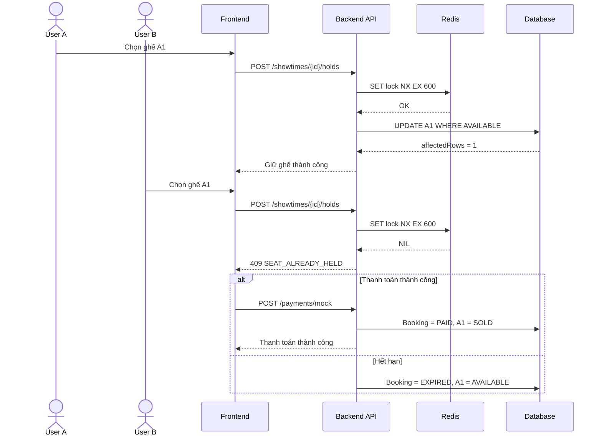

# [Ticket Hunting] Thiết kế luồng săn vé xem phim

Tài liệu này mô tả đầy đủ nghiệp vụ săn vé cho Issue #69, gồm điều kiện mở bán, trạng thái ghế, quy tắc giữ ghế, xử lý đồng thời, đơn hết hạn, thanh toán, lỗi nghiệp vụ, sequence diagram và test scenarios.

## Bằng chứng

- Issue: https://github.com/Minhhanh-zit/CNPM/issues/69
- Tài liệu: https://github.com/Minhhanh-zit/CNPM/blob/main/.github/Tu%E1%BA%A7n%205/%5BTicket%20Hunting%5D%20Thi%E1%BA%BFt%20k%E1%BA%BF%20lu%E1%BB%93ng%20s%C4%83n%20v%C3%A9%20xem%20phim/p21.md
- Commit nội dung chính: https://github.com/Minhhanh-zit/CNPM/commit/80a33b6b7e145418cf167cc19a698d1a53b38532

## Điều kiện mở bán

Người dùng chỉ được săn vé khi suất chiếu ở trạng thái `OPEN_FOR_SALE`, đã đến thời điểm mở bán và chưa tới thời điểm đóng bán trực tuyến. Hệ thống dừng bán online trước giờ chiếu 15 phút.

## Trạng thái ghế

| Trạng thái | Ý nghĩa |
|---|---|
| `AVAILABLE` | Ghế còn trống |
| `HELD` | Ghế đang được giữ tạm thời |
| `SOLD` | Ghế đã thanh toán |
| `BLOCKED` | Ghế bị khóa |

Luồng hợp lệ: `AVAILABLE → HELD → SOLD`.

## Quy tắc giữ ghế

- Thời gian giữ ghế: 10 phút.
- Tối đa 8 ghế mỗi đơn.
- Các ghế phải thuộc cùng một suất chiếu.
- Giữ nhiều ghế theo nguyên tắc all-or-nothing.
- Backend tính thời gian hết hạn theo thời gian máy chủ.

## Xử lý đồng thời

Redis lock:

```text
SET seat_hold:{showtimeId}:{seatId} {userId} NX EX 600
```

Conditional update:

```sql
UPDATE showtime_seats
SET status = 'HELD',
    held_by_user_id = @userId,
    held_until = @heldUntil,
    booking_order_id = @bookingOrderId
WHERE showtime_id = @showtimeId
  AND seat_id = @seatId
  AND status = 'AVAILABLE';
```

Tạo đơn, cập nhật ghế và tạo booking seat phải nằm trong cùng transaction. Nếu một bước lỗi thì rollback và xóa Redis lock.

## Đơn hết hạn

Khi `current_server_time >= held_until` và đơn chưa thanh toán:

1. Chuyển đơn sang `EXPIRED`.
2. Chuyển ghế về `AVAILABLE`.
3. Xóa thông tin giữ ghế và Redis lock.
4. Không cho phép tiếp tục thanh toán.
5. Phát sự kiện realtime `seat_released`.

## Thanh toán

Thanh toán thành công chuyển đơn sang `PAID`, ghế sang `SOLD`, xóa lock và phát hành vé đúng một lần. Thanh toán thất bại không tạo vé. Request lặp phải được xử lý idempotent.

## Lỗi nghiệp vụ chính

| Mã lỗi | HTTP |
|---|---:|
| `SALE_NOT_OPEN` | 403 |
| `SALE_CLOSED` | 410 |
| `MAX_SEATS_EXCEEDED` | 400 |
| `SEAT_NOT_AVAILABLE` | 409 |
| `SEAT_ALREADY_HELD` | 409 |
| `SEAT_ALREADY_SOLD` | 409 |
| `SEAT_BLOCKED` | 409 |
| `HOLD_EXPIRED` | 410 |
| `ORDER_EXPIRED` | 410 |
| `PAYMENT_FAILED` | 402 |

## Sequence Diagram



## Test scenarios

- Giữ một ghế trống.
- Giữ nhiều ghế hợp lệ.
- Một ghế trong nhóm không khả dụng.
- Hai user cùng chọn một ghế.
- Chọn quá 8 ghế.
- Hết 10 phút không thanh toán.
- Thanh toán thành công.
- Thanh toán thất bại.
- Callback thanh toán lặp.
- Suất chưa mở hoặc đã đóng bán.
- Redis thành công nhưng database lỗi.
- Refresh trang thanh toán và tiếp tục countdown theo server.
