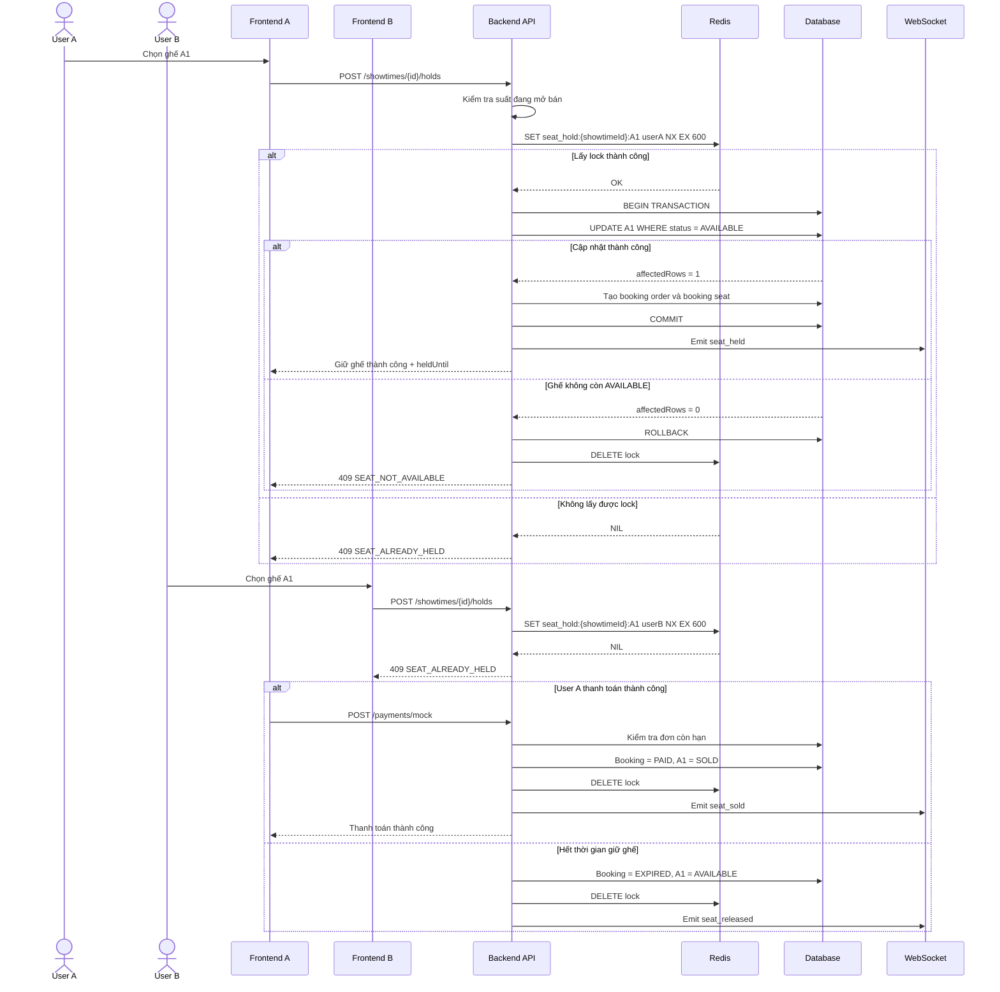

# [Ticket Hunting] Thiết kế luồng săn vé xem phim

## 1. Thông tin chung

- **Issue:** [#69](https://github.com/Minhhanh-zit/CNPM/issues/69)
- **Người phụ trách:** BA/DA – Minhhanh-zit
- **Hệ thống:** CineHunt
- **Mục tiêu:** Thiết kế luồng nghiệp vụ săn vé khi nhiều người dùng cùng chọn ghế, làm căn cứ thống nhất cho frontend, backend và kiểm thử.

## Bằng chứng thực hiện

- **Tài liệu:** [p21.md](https://github.com/Minhhanh-zit/CNPM/blob/main/.github/Tu%E1%BA%A7n%205/%5BTicket%20Hunting%5D%20Thi%E1%BA%BFt%20k%E1%BA%BF%20lu%E1%BB%93ng%20s%C4%83n%20v%C3%A9%20xem%20phim/p21.md)
- **Commit nội dung:** [80a33b6b7e145418cf167cc19a698d1a53b38532](https://github.com/Minhhanh-zit/CNPM/commit/80a33b6b7e145418cf167cc19a698d1a53b38532)
- **Commit bổ sung bằng chứng:** [110f3a41b611175fd2450e62d09d77dab06c6faf](https://github.com/Minhhanh-zit/CNPM/commit/110f3a41b611175fd2450e62d09d77dab06c6faf)
- **Thư mục:** [.github/Tuần 5/[Ticket Hunting] Thiết kế luồng săn vé xem phim](https://github.com/Minhhanh-zit/CNPM/tree/main/.github/Tu%E1%BA%A7n%205/%5BTicket%20Hunting%5D%20Thi%E1%BA%BFt%20k%E1%BA%BF%20lu%E1%BB%93ng%20s%C4%83n%20v%C3%A9%20xem%20phim)

---

## 2. Phạm vi

Tài liệu mô tả:

- Thời điểm mở và đóng bán vé.
- Điều kiện người dùng được truy cập màn hình chọn ghế.
- Trạng thái ghế theo từng suất chiếu.
- Quy tắc giữ ghế và hết hạn giữ ghế.
- Xử lý hai hoặc nhiều người dùng cùng chọn một ghế.
- Luồng từ chọn ghế đến thanh toán.
- Xử lý đơn quá hạn.
- Thông báo lỗi nghiệp vụ.
- Sequence diagram phục vụ triển khai và kiểm thử.

---

## 3. Điều kiện mở bán vé

Người dùng chỉ được chọn và giữ ghế khi:

- Suất chiếu tồn tại.
- Suất chiếu ở trạng thái `OPEN_FOR_SALE`.
- Thời gian hiện tại đã đến thời điểm mở bán.
- Thời gian hiện tại chưa vượt quá thời điểm đóng bán trực tuyến.
- Người dùng đã đăng nhập và tài khoản không bị khóa.

Hệ thống dừng bán vé trực tuyến **15 phút trước giờ bắt đầu suất chiếu**.

Ví dụ:

```text
Suất chiếu bắt đầu: 20:00
Thời điểm dừng bán trực tuyến: 19:45
```

Các trường hợp không cho phép chọn ghế:

- Chưa đến thời gian mở bán.
- Suất chiếu đã đóng bán.
- Suất chiếu đã bắt đầu.
- Suất chiếu bị hủy.
- Người dùng chưa đăng nhập.
- Tài khoản bị khóa.

---

## 4. Trạng thái ghế

Mỗi ghế trong từng suất chiếu có một trạng thái riêng.

| Trạng thái | Ý nghĩa |
|---|---|
| `AVAILABLE` | Ghế đang trống và có thể được giữ |
| `HELD` | Ghế đang được một người dùng giữ tạm thời |
| `SOLD` | Ghế đã được thanh toán thành công |
| `BLOCKED` | Ghế bị khóa bởi nhân viên hoặc quản trị viên |

Một ghế ở trạng thái `HELD` cần lưu:

- `held_by_user_id`: người đang giữ ghế.
- `held_until`: thời điểm hết hạn giữ ghế.
- `booking_order_id`: đơn hàng liên quan.

---

## 5. Bảng chuyển trạng thái ghế

| Trạng thái hiện tại | Sự kiện | Trạng thái mới | Điều kiện |
|---|---|---|---|
| `AVAILABLE` | User giữ ghế | `HELD` | Suất đang mở bán và giữ ghế thành công |
| `AVAILABLE` | Admin khóa ghế | `BLOCKED` | Admin có quyền |
| `HELD` | Thanh toán thành công | `SOLD` | Đơn còn hạn |
| `HELD` | Hết thời gian giữ | `AVAILABLE` | `held_until <= server_time` |
| `HELD` | User hủy đơn | `AVAILABLE` | Đơn chưa thanh toán |
| `BLOCKED` | Admin mở khóa | `AVAILABLE` | Ghế chưa được bán |
| `SOLD` | User yêu cầu giữ | `SOLD` | Từ chối yêu cầu |

Luồng hợp lệ thông thường:

```text
AVAILABLE → HELD → SOLD
```

Không cho phép chuyển trực tiếp từ `AVAILABLE` sang `SOLD` trong luồng đặt vé online.

---

## 6. Quy tắc giữ ghế

- Thời gian giữ ghế mặc định: **10 phút**.
- Thời gian hết hạn được backend tính theo thời gian máy chủ.
- Frontend chỉ hiển thị countdown, không tự quyết định hạn giữ.
- Một đơn được chọn tối đa **8 ghế**.
- Các ghế trong cùng một request phải thuộc cùng một suất chiếu.
- Chỉ ghế `AVAILABLE` mới được phép giữ.
- Một user không được tạo nhiều đơn giữ ghế còn hạn cho cùng một suất chiếu.

### Giữ nhiều ghế

Việc giữ nhiều ghế áp dụng nguyên tắc **all-or-nothing**:

- Nếu toàn bộ ghế đều giữ thành công thì tạo đơn.
- Nếu một ghế không còn khả dụng thì toàn bộ request thất bại.
- Không tạo đơn chỉ chứa một phần số ghế user đã chọn.

---

## 7. Xử lý nhiều user cùng chọn một ghế

Để tránh bán trùng ghế, backend phải thực hiện thao tác khóa nguyên tử.

### Redis lock

Mỗi ghế sử dụng một key:

```text
seat_hold:{showtimeId}:{seatId}
```

Lệnh đề xuất:

```text
SET seat_hold:{showtimeId}:{seatId} {userId} NX EX 600
```

Trong đó:

- `NX`: chỉ tạo key nếu chưa tồn tại.
- `EX 600`: lock hết hạn sau 600 giây.
- Chỉ request nhận `OK` mới được tiếp tục.

### Conditional update trong database

```sql
UPDATE showtime_seats
SET status = 'HELD',
    held_by_user_id = @userId,
    held_until = @heldUntil,
    booking_order_id = @bookingOrderId,
    updated_at = CURRENT_TIMESTAMP
WHERE showtime_id = @showtimeId
  AND seat_id = @seatId
  AND status = 'AVAILABLE';
```

Kết quả xử lý:

- `affectedRows = 1`: giữ ghế thành công.
- `affectedRows = 0`: giữ ghế thất bại.
- Nếu database thất bại, backend phải xóa Redis lock vừa tạo.

Việc tạo đơn, cập nhật ghế và tạo chi tiết ghế phải chạy trong cùng transaction. Nếu một bước lỗi thì rollback toàn bộ.

---

## 8. Trạng thái đơn hàng

| Trạng thái | Ý nghĩa |
|---|---|
| `PENDING_HOLD` | Đơn đang giữ ghế |
| `PENDING_PAYMENT` | Đơn đang chờ thanh toán |
| `PAID` | Thanh toán thành công |
| `PAYMENT_FAILED` | Thanh toán thất bại |
| `EXPIRED` | Đơn đã hết thời gian giữ |
| `CANCELLED` | Đơn bị hủy |

| Trạng thái hiện tại | Sự kiện | Trạng thái mới |
|---|---|---|
| `PENDING_HOLD` | Chuyển sang thanh toán | `PENDING_PAYMENT` |
| `PENDING_HOLD` | Hết hạn | `EXPIRED` |
| `PENDING_PAYMENT` | Thanh toán thành công | `PAID` |
| `PENDING_PAYMENT` | Thanh toán thất bại | `PAYMENT_FAILED` |
| `PENDING_PAYMENT` | Hết hạn | `EXPIRED` |

---

## 9. Xử lý đơn quá hạn

Khi thời gian máy chủ lớn hơn hoặc bằng `held_until` và đơn chưa thanh toán thành công, hệ thống phải:

1. Chuyển đơn sang `EXPIRED`.
2. Chuyển các ghế `HELD` về `AVAILABLE`.
3. Xóa `held_by_user_id` và `held_until`.
4. Xóa Redis lock.
5. Thông báo realtime để các client cập nhật sơ đồ ghế.
6. Không cho phép tiếp tục thanh toán đơn đã hết hạn.

Hệ thống không được chỉ phụ thuộc vào countdown của frontend. Backend phải kiểm tra lại hạn giữ ghế trước mọi thao tác thanh toán.

---

## 10. Xử lý thanh toán

Trước khi thanh toán, backend kiểm tra:

- Đơn tồn tại.
- Đơn thuộc đúng user.
- Đơn chưa hết hạn.
- Các ghế vẫn ở trạng thái `HELD`.
- Các ghế thuộc đúng đơn và đúng người giữ.

Khi thanh toán thành công:

1. Chuyển payment sang `SUCCESS`.
2. Chuyển booking order sang `PAID`.
3. Chuyển ghế từ `HELD` sang `SOLD`.
4. Xóa Redis lock.
5. Phát hành vé đúng một lần.
6. Thông báo realtime `seat_sold`.

Nếu thanh toán thất bại:

- Không tạo vé.
- Không chuyển ghế sang `SOLD`.
- User có thể thanh toán lại nếu đơn còn hạn.

Request thanh toán lặp phải được xử lý idempotent để không tạo nhiều payment hoặc nhiều vé cho cùng một đơn.

---

## 11. Đồng bộ trạng thái realtime

Backend có thể dùng WebSocket hoặc Socket.IO với các sự kiện:

| Sự kiện | Ý nghĩa |
|---|---|
| `seat_held` | Ghế vừa được giữ |
| `seat_released` | Ghế được giải phóng |
| `seat_sold` | Ghế đã bán |
| `seat_blocked` | Ghế bị khóa |
| `seat_unblocked` | Ghế được mở khóa |

Payload đề xuất:

```json
{
  "showtimeId": 101,
  "seatId": 25,
  "seatCode": "A1",
  "status": "HELD",
  "expiresAt": "2026-06-23T11:30:00Z"
}
```

Không gửi thông tin cá nhân của người đang giữ ghế cho user khác.

---

## 12. Danh sách lỗi nghiệp vụ

| Mã lỗi | HTTP | Trường hợp | Thông báo |
|---|---:|---|---|
| `SHOWTIME_NOT_FOUND` | 404 | Không tìm thấy suất chiếu | Suất chiếu không tồn tại |
| `SALE_NOT_OPEN` | 403 | Chưa mở bán | Vé chưa được mở bán |
| `SALE_CLOSED` | 410 | Đã đóng bán | Suất chiếu đã ngừng bán trực tuyến |
| `SHOWTIME_CANCELLED` | 410 | Suất bị hủy | Suất chiếu đã bị hủy |
| `AUTHENTICATION_REQUIRED` | 401 | Chưa đăng nhập | Vui lòng đăng nhập |
| `MAX_SEATS_EXCEEDED` | 400 | Chọn quá 8 ghế | Chỉ được chọn tối đa 8 ghế |
| `SEAT_NOT_AVAILABLE` | 409 | Ghế không còn trống | Ghế vừa được người khác chọn |
| `SEAT_ALREADY_HELD` | 409 | Ghế đang được giữ | Ghế đang được giữ tạm thời |
| `SEAT_ALREADY_SOLD` | 409 | Ghế đã bán | Ghế đã được bán |
| `SEAT_BLOCKED` | 409 | Ghế bị khóa | Ghế hiện không được phép đặt |
| `HOLD_EXPIRED` | 410 | Hết thời gian giữ | Thời gian giữ ghế đã hết |
| `ORDER_EXPIRED` | 410 | Đơn hết hạn | Đơn hàng đã hết hạn |
| `PAYMENT_FAILED` | 402 | Thanh toán thất bại | Thanh toán không thành công |
| `PAYMENT_ALREADY_PROCESSED` | 409 | Request lặp | Giao dịch đã được xử lý |

---

## 13. Sequence Diagram



---

## 14. Test scenarios chính

| Mã | Kịch bản | Kết quả mong đợi |
|---|---|---|
| `TH-01` | User giữ một ghế còn trống | Ghế chuyển `AVAILABLE → HELD` |
| `TH-02` | User giữ nhiều ghế hợp lệ | Tất cả ghế được giữ |
| `TH-03` | Một ghế trong nhóm không khả dụng | Toàn bộ request thất bại |
| `TH-04` | Hai user cùng chọn A1 | Chỉ một user thành công |
| `TH-05` | Chọn quá 8 ghế | Trả `MAX_SEATS_EXCEEDED` |
| `TH-06` | Hết 10 phút không thanh toán | Đơn `EXPIRED`, ghế `AVAILABLE` |
| `TH-07` | Thanh toán thành công còn hạn | Ghế `SOLD`, tạo vé |
| `TH-08` | Thanh toán thất bại | Không tạo vé |
| `TH-09` | Gửi callback thanh toán hai lần | Chỉ tạo một payment và một vé |
| `TH-10` | User khác thanh toán đơn | Từ chối truy cập |
| `TH-11` | Suất chưa mở bán | Trả `SALE_NOT_OPEN` |
| `TH-12` | Suất đã đóng bán | Trả `SALE_CLOSED` |
| `TH-13` | Ghế bị admin khóa | Không được giữ |
| `TH-14` | Redis lock thành công nhưng DB lỗi | Rollback và xóa lock |
| `TH-15` | User refresh trang thanh toán | Countdown tiếp tục theo thời gian server |

---

## 15. Kết quả đầu ra

- Có mô tả thời điểm mở và đóng bán vé.
- Có bảng trạng thái và quy tắc chuyển trạng thái ghế.
- Có quy tắc giữ ghế 10 phút và tối đa 8 ghế.
- Có xử lý hai user cùng chọn một ghế.
- Có xử lý đơn hết hạn và thanh toán.
- Có danh sách lỗi nghiệp vụ.
- Có sequence diagram.
- Có test scenarios để frontend, backend và tester sử dụng chung.

---

## 16. Kết luận

Thiết kế đảm bảo một ghế trong một suất chiếu chỉ được giữ hoặc bán cho một người dùng tại một thời điểm. Redis lock, conditional update và database transaction được kết hợp để hạn chế race condition, tránh bán trùng ghế và đảm bảo dữ liệu nhất quán giữa frontend, backend và database.
